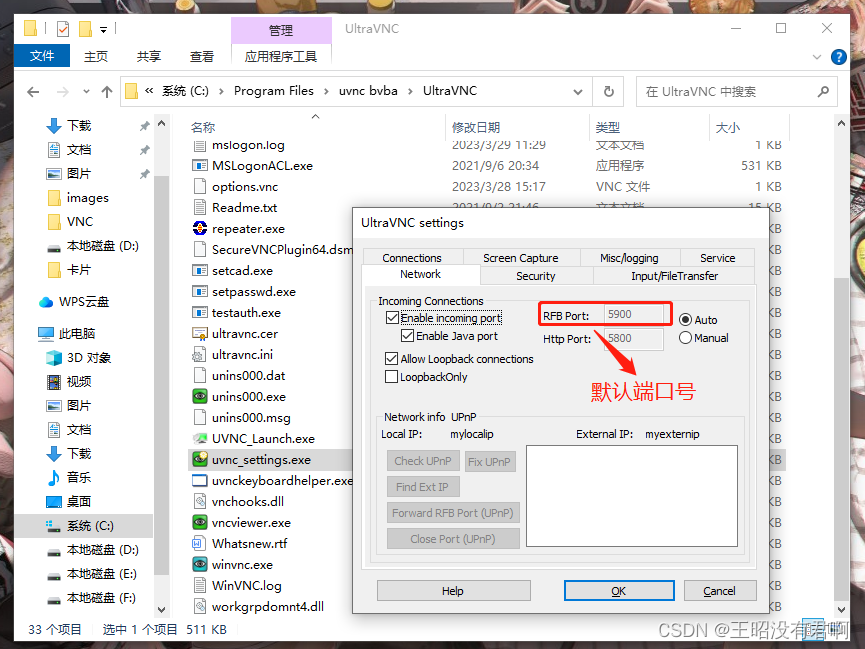
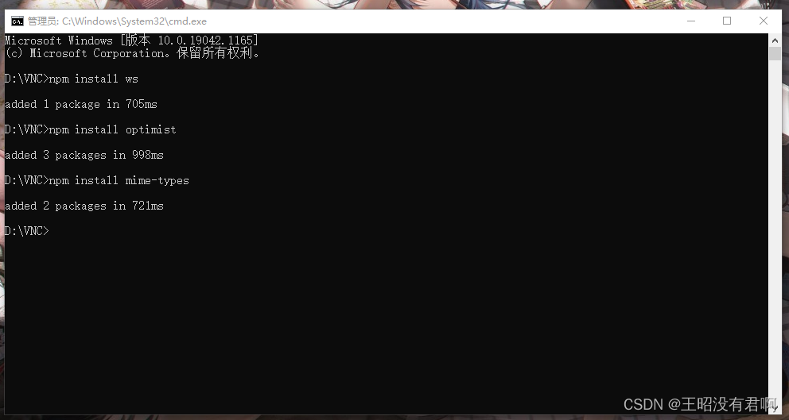
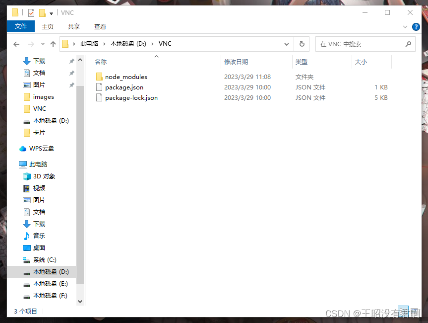
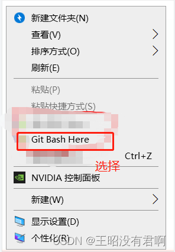
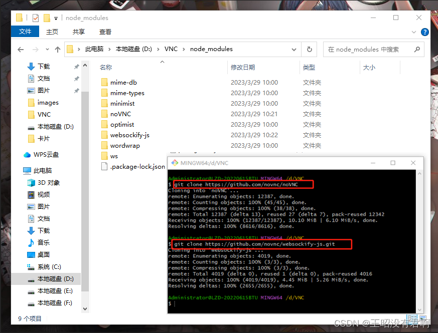
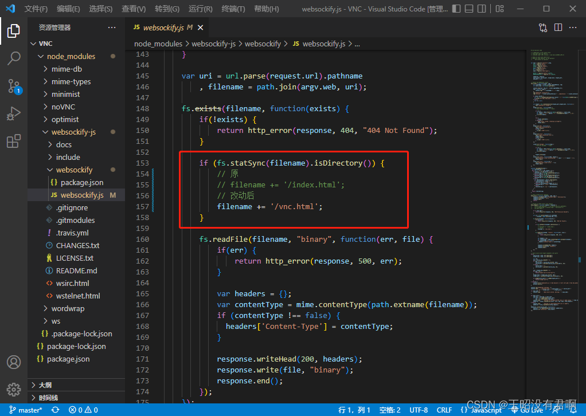
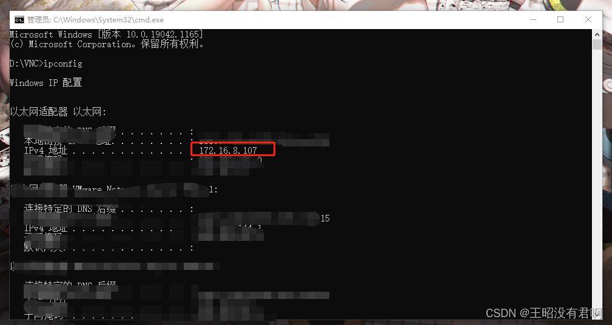

- [windows通过浏览器访问noVNC（基于web的远程桌面）-CSDN博客](https://blog.csdn.net/weixin_58448088/article/details/129834143)
  tags:: [[SendToLogseq]]
	- **目录**
	- 一、什么是VNC 和 noVNC？
	- 二、Windows10安装及配置noVNC
	- 2.0、注释
	- 2.1、下载UltraVNC
	- 2.2、下载Node.js
	- 2.3、下载安装git
	- 2.4、创建一个存放文件的文件夹
	- 2.5、安装ws、optimist、mime-types模块（执行websockify.js文件所需）
	- 2.6、下载noVNC、下载websockify-js
	- 2.7、修改websockify.js文件
	- 2.8、查看自己电脑主机IP
	- 2.9、执行websockify.js
	- 三、成果展示
	- ***
	- ## 一、什么是VNC 和 noVNC？
	- VNC (Virtual Network Console)是虚拟网络控制台的缩写，分为server端和client端两部分，分别部署完成后在server端简单的配置即可使用，基于TCP的通信。noVNC项目是通过取消VNC Client的安装，直接通过浏览器访问noVNC，然后由noVNC间接访问VNC server来达到client web化。VNC server处理的始终是TCP流量，但是浏览器和noVNC之间是在http基础上使用WebSocket交互，由于VNC server 无法处理websocket流量，因此引入了 websockify ，noVNC的姐妹项目，负责把WebSocket流量转换为普通的TCP流，使VNC server正常工作。noVNC其实是一个HTML形式的APP，websockify并充当了一个mini web server的角色，当浏览器访问时，会通过网络加载运行noVNC。
	- ## 二、Windows10安装及配置noVNC
	- ### 2.0、注释
	- 我会上传和我版本一样的UltraVNC、Node.js安装包，可以免费下载，所需积分为0。
	- UltraVNC安装包下载：
	- UltraVNC安装包资源-CSDN文库{:width 14 :height 14}https://download.csdn.net/download/weixin\_58448088/87626312?spm=1001.2014.3001.5503Node.js安装包下载：
	- node.js(v16.16.0)安装包资源-CSDN文库{:width 14 :height 14}https://download.csdn.net/download/weixin\_58448088/87626324?spm=1001.2014.3001.5503
	- ### 2.1、下载UltraVNC
	- Home - UltraVNC VNC OFFICIAL SITE, Remote Desktop Free Opensource (uvnc.com){:width 14 :height 14}https://uvnc.com/
	- 选择你想要下载的版本，选择好下载的路径，傻瓜式安装即可，一直next就好。
	- 安装好后，找到安装的文件夹，找到uvnc\_settings.exe鼠标右键，点击以管理员身份运行，就会弹出如下页面，第一张为默认端口号，第二张设置远程访问VNC密码，设置远程只查看密码。
	- 
	- ### 2.2、下载Node.js
	- 下载node.js是为了执行websockify.js
	- 配置Node.js环境变量\_王昭没有君啊的博客-CSDN博客{:width 14 :height 14}https://blog.csdn.net/weixin\_58448088/article/details/129838885?spm=1001.2014.3001.5501
	- ### 2.3、下载安装git
	- git安装和使用\_git安装使用\_王昭没有君啊的博客-CSDN博客详细介绍git工具如何安装，手把手教你一步步怎样创建远程仓库和远程仓库分支，怎样解决代码冲突，怎样回退版本，怎样克隆代码{:width 14 :height 14}https://blog.csdn.net/weixin\_58448088/article/details/123187457?spm=1001.2014.3001.5501
	- ### 2.4、创建一个存放文件的文件夹
	- 在D盘新建VNC文件夹，准备存放noVNC所需的文件
	- ### 2.5、安装ws、optimist、mime-types模块（执行websockify.js文件所需）
	- 打开cmd，并进入到D盘下的VNC文件夹中，执行如下命令
	- ```html
	  npm install wsnpm install optimistnpm install mime-types
	  ```
	- 
	- 安装好这些 模块后，会在VNC文件中自动生成如下文件
	- 
	- ### 2.6、下载noVNC、下载websockify-js
	- 进入VNC文件中的node\_modules文件夹中,鼠标右键选择 Git Bash Here
	- 
	- 进入到如下窗口，通过git下载noVNC、websockify-js
	- ```html
	  git clone https://github.com/novnc/noVNCgit clone https://github.com/novnc/websockify-js.git
	  ```
	- 
	- ### 2.7、修改websockify.js文件
	- 修改 D:\VNC\node\_modules\websockify-js\websockify中的websockify.js，将
	- ```html
	  filename += '/index.html';
	  ```
	- 改为
	- ```html
	  filename += '/vnc.html';
	  ```
	- 
	- ###  2.8、查看自己电脑主机IP
	- 打开cmd，输入如下命令行，如图红圈框住的就是主机IP
	- ```html
	  ipconfig
	  ```
	- 
	- ### 2.9、执行websockify.js
	- 说明一下整个过程，我这边通过安装UltraVNC（提供VNC Server），然后在VNC Server中通过node执行websockify.js：转发9000端口的http链接到5900端口，就可以正常运行noVNC了。
	- 打开cmd输入如下命令,启动代理服务：
	- ```html
	  node D:\VNC\node_modules\websockify-js\websockify\websockify.js --web D:\VNC\node_modules\noVNC 8000 localhost:5900
	  ```
	- 命令行解释：
	- ```html
	  node  // 使用node执行websockify.jsD:\VNC\node_modules\websockify-js\websockify\websockify.js // websockify.js文件路径 --web D:\VNC\node_modules\noVNC // noVNCD文件路径8000 // 启动端口为8000，这个可以自己设，不一定就是8000localhost:5900 // 转发的VNC地址和端口
	  ```
	- ## {:width 962 :height 502}
	- ## 三、成果展示
	- 3.1、在浏览器输入http:// 主机ip:启动端口/vnc.html
	- 示例：
	- ```html
	  http://172.16.8.107:8000/vnc.html
	  ```
	- 3.2、输入网址后，进入如下页面点击连接
	- {:width 962 :height 634}
	- 3.3、点击连接跳转到如下页面，输入之前设置的远程访问VNC密码，回车
	- {:width 962 :height 634}
	- 3.4、成功连接到本机
	- {:width 962 :height 541}
	- 3.5、注意连接后，不要关掉cmd，要保持web server代理服务一直开启
	- {:width 962 :height 545}
	- 3.6、关闭代理服务，ctrl+c
	- {:width 962 :height 543}
-