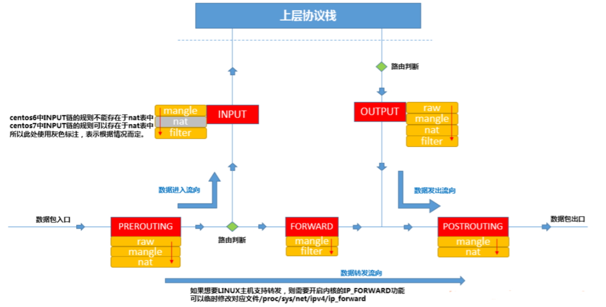
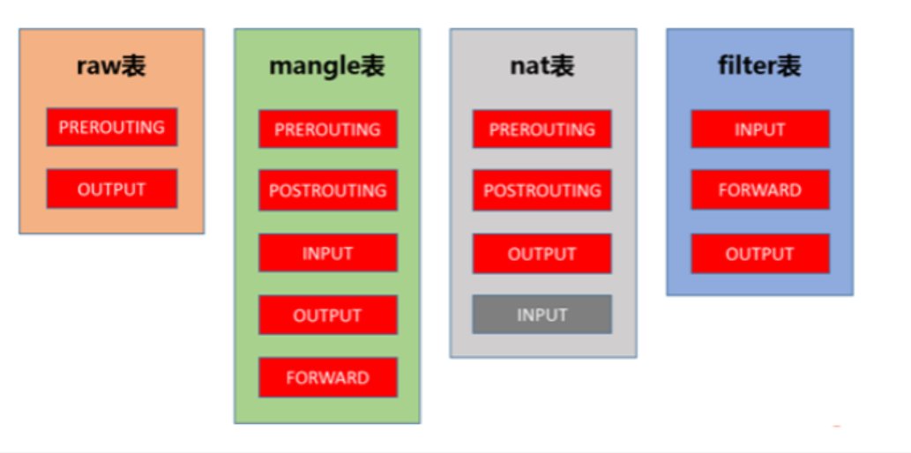

- 放行（accept）拒绝（reject）丢弃（drop）.
-
- ***数据经过防火墙的流程***
	- 
- ***在写iptables规则的时，需要牢记这张图的规则***
	- 
-
-
- ***到本机某进程的报文：***
	- PREROUTING(路由前) –> INPUT
- ***由本机转发的报文：***
	- PREROUTING（路由前） –> FORWARD（转发） –> POSTROUTING（路由后）
- ***由本机的某进程发出报文（通常为响应报文）：***
	- OUTPUT –> POSTROUTING（路由后）
-
- ***filter表：***负责过滤功能，防火墙；比如允许哪些IP地址访问，拒绝哪些IP地址访问，允许访问哪些端口，禁止访问哪些端口，filter表会根据我们定义的规则进行过滤，filter表应该是我们最常用到的表了内核模块：iptables_filter；表中的规则可以被以下链使用：INPUT，FORWARD，OUTPUT
-
- ***nat表：***network address translation，网络地址转换功能；内核模块：iptable_nat；表中的规则可以被以下链使用：PREROUTING，OUTPUT，POSTROUTING（centos7中还有INPUT，centos6中没有）
-
- ***mangle表：***拆解报文，做出修改，并重新封装 的功能；iptable_mangle；表中的规则以下链使用：PREROUTING，INPUT，FORWARD，OUTPUT，POSTROUTING
-
- ***raw表：***关闭nat表上启用的连接追踪机制；iptable_raw；表中的规则可以被以下链使用：PREROUTING，OUTPUT
-
- ***执行优先级：***raw –> mangle –> nat –> filter
-
- ***处理动作***
	- ACCEPT：允许数据包通过。
	  DROP：直接丢弃数据包，不给任何回应信息，这时候客户端会感觉自己的请求泥牛入海了，过了超时时间才会有反应
	  REJECT：拒绝数据包通过，必要时会给数据发送端一个响应的信息，客户端刚请求就会收到拒绝的信息。
	  SNAT：源地址转换，解决内网用户用同一个公网地址上网的问题。
	  MASQUERADE：是SNAT的一种特殊形式，适用于动态的、临时会变的ip上
	  DNAT：目标地址转换。
	  REDIRECT：在本机做端口映射。
	  LOG：在/var/log/messages文件中记录日志信息，然后将数据包传递给下一条规则，也就是说除了记录以外不对数据包做任何其他操作，仍然让下一条规则去匹配。
	  QUEUE：将数据包移交到用户空间
	  RETURN：防火墙停止执行当前链中的后续rules 并返回到调用链（the calling chain）中
-