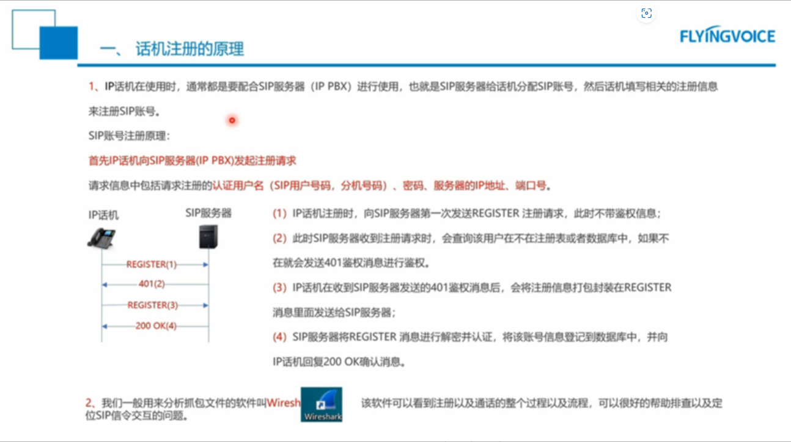

- 
- 常见错误代码
	- 403 账号密码错
	- 404 没有这个分机，服务器分机是否创建好
	- 423 Interval Too Brief 注册刷新时间过小
	- 503 服务器暂时不可
	- Register Faile，TimeOut 网络不通或者IP地址、端口填写错误
	- 话机在内网，SIP服务器在公网，遇到注册失败，可以尝试将话机的 Rport 参数改为“直接流程”
	- SIP用户代理头域名称，一般用于注册品牌IP PBX	的UA（用户代理）认证
	- SIP服务器是否有特殊的鉴权认证（如思科的IP PBX需要关联下账号的 Digest user
	- G.711(U-law, A-law)