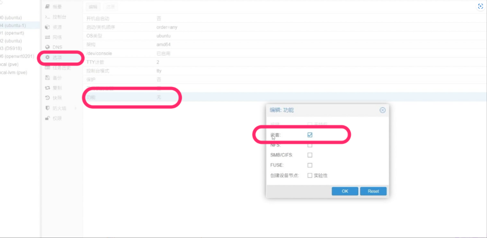

- ### 创建CT
	- 主机名随意
	- 设置改密码
	- 不勾选**无特权容器**,如果勾选，启动docker的时候会报错
- ### 设置权限
	- 打开创建好的虚拟机--点击选项--功能--勾选嵌套后保存
	- 经典的俄罗斯套娃模式
	- 
	- cd /etc/pve/lxc/
		- 添加
		- lxc.apparmor.profile: unconfined
		- lxc.cgroup.devices.allow: a
		- lxc.cap.drop:
- ### 安装docker
	- 更改时区
		- dpkg-reconfigure tzdata
	- 开启ssh访问
		- vi etc/ssh/sshd_config  实现其他主机SSH可访问改 permitrootlogin  为  yes
	- 解决debian或者乌班图都存在默认的方向键不好用
		- vi  etc/vim/vimrc.tiny
		- ```clojure
		  - set nocompatible
		  - set backspace=2
		  ```
	- ```clojure
	  sudo apt-get update 
	  sudo apt-get install ca-certificates curl gnupg lsb-release
	  ```
	- ```clojure
	  #添加docker官方密钥
	  curl -fsSL https://download.docker.com/linux/ubuntu/gpg | sudo gpg --dearmor -o /usr/share/keyrings/docker-archive-keyring.gpg
	  #设置稳定存储库
	  echo  "deb [arch=$(dpkg --print-architecture) signed-by=/usr/share/keyrings/docker-archive-keyring.gpg] https://download.docker.com/linux/ubuntu  $(lsb_release -cs) stable" | sudo tee /etc/apt/sources.list.d/docker.list > /dev/null
	  #安装docker
	  sudo apt-get install docker-ce docker-ce-cli containerd.io -y
	  ```
-
-