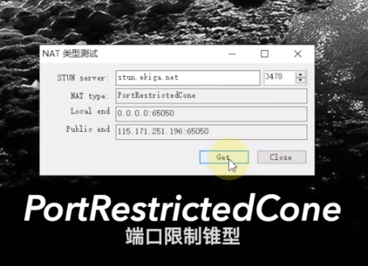

- NAT（Network Address Translation网络地址转换）是指将IP数据包头中的IP地址转换为另一个IP地址的过程
- NAT有4个类型，它们分别是：NAT1、NAT2、NAT3、NAT4
	- **NAT1: Full Cone NAT，全锥形NAT**
		- [[$red]]==一对多==，路由器的一个端口可以和不同外网设备的不同端口进行交互
		- 最宽松的网络环境，一般用于P2P组网，安全性最差，路由器中的DZM就属于全锥形
	- NAT2: Address-Restricted Cone NAT，受限锥型NAT，相比NAT1，NAT2 增加了地址限制，也就是IP受限，而端口不受限。
	- NAT3: Port-Restricted Cone NAT，端口受限锥型，相比NAT2，NAT3 又增加了端口限制，也就是说IP、端口都受限。
	- NAT4: Symmetric NAT，对称型NAT，
		- [[$red]]==一对一==，路由器的一个端口只能和一个外网设备一个端口进行交互
		- 对称型NAT具有端口受限锥型的受限特性，内部地址每一次请求一个特定的外部地址，都可能会绑定到一个新的端口号。
- 辨别NAT类型
	- PC端建议使用NatTypeTest进行测试
	- 
	- 
	- 
	-