### OpenWRT各种固件版本
	- combined-ext4.img.gz
		-
	- combined-squashfs.img.gz
	- generic-rootfs.tar.gz
	- rootfs-ext4.img.gz
	- rootfs-squashfs.img.gz
	- vmlinuz
- ### EXT4固件
  collapsed:: true
	- 
	- #### 挂载分区方式
		- ***未格式化分区-->新建主分区-->复制根目录内容到新分区-->把原系统根目录默认挂载点变成新分区***
		- 
			- 需要用到两个插件 ***fdisk**** 磁盘分区插件   ***block-mount*** 挂载点插件
				- 查看现有分区，fdisk -l
					- 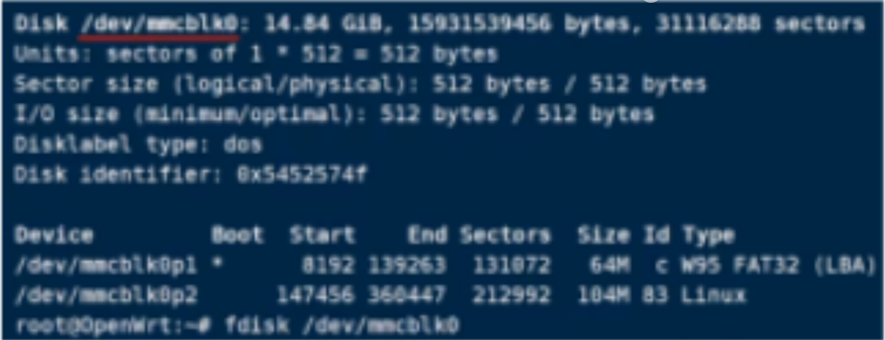
				- 注意最后一个分区的结束，新建分区必须大于最后一个分区数值
				  collapsed:: true
					- 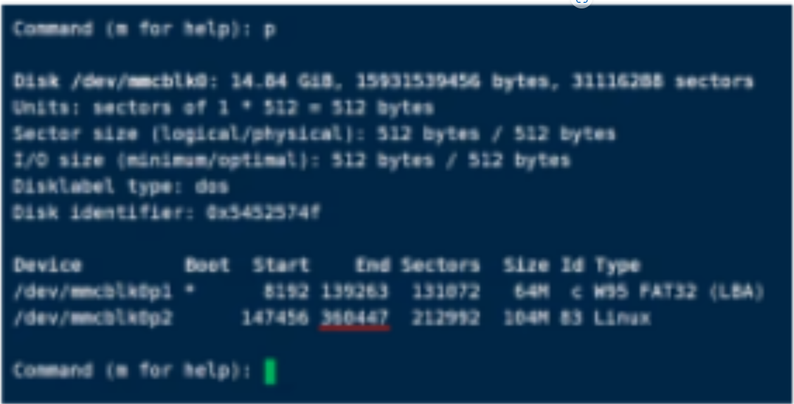
				- 新建主分区，数值大于前结束分区
				  collapsed:: true
					- 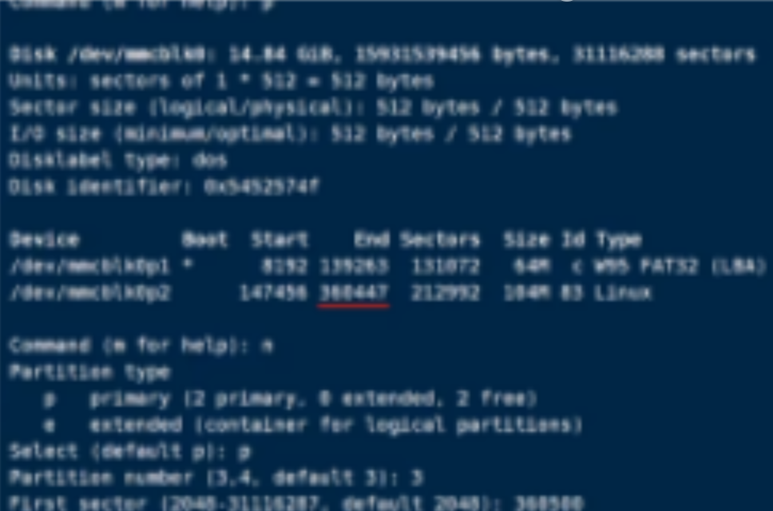
				- 扩大容量可以直接输入数值，并存盘
				  collapsed:: true
					- 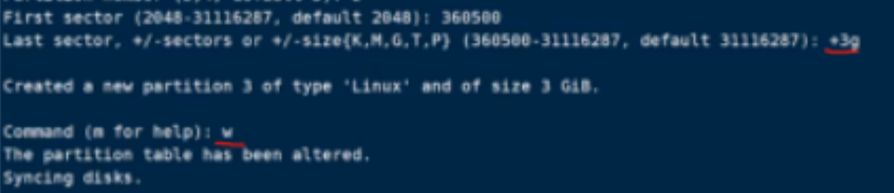
				- 查看新分区容量情况，此时并没有生效
				  collapsed:: true
					- 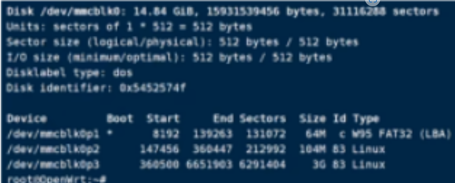
				- 格式化新分区，如果没有MKFS.ext4命令，请安装e2fsprogs插件
				  collapsed:: true
					- 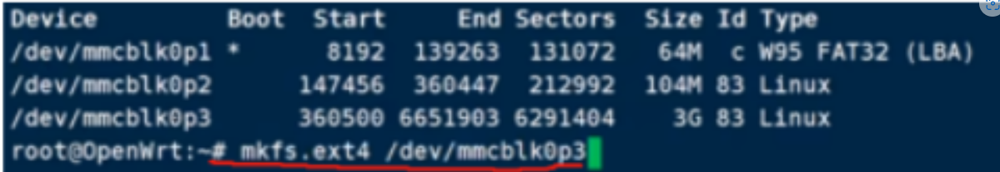
				- 在UI界面挂载为根分区，并复制命令
				  collapsed:: true
					- 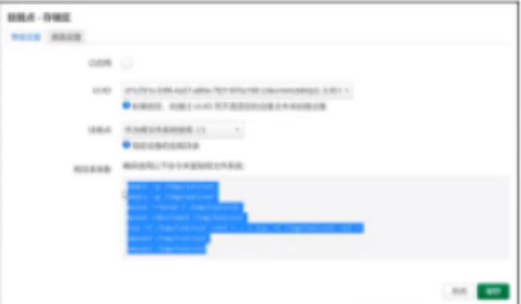
				- 粘贴命令，实现复制旧根分区文件到新分区
				  collapsed:: true
					- 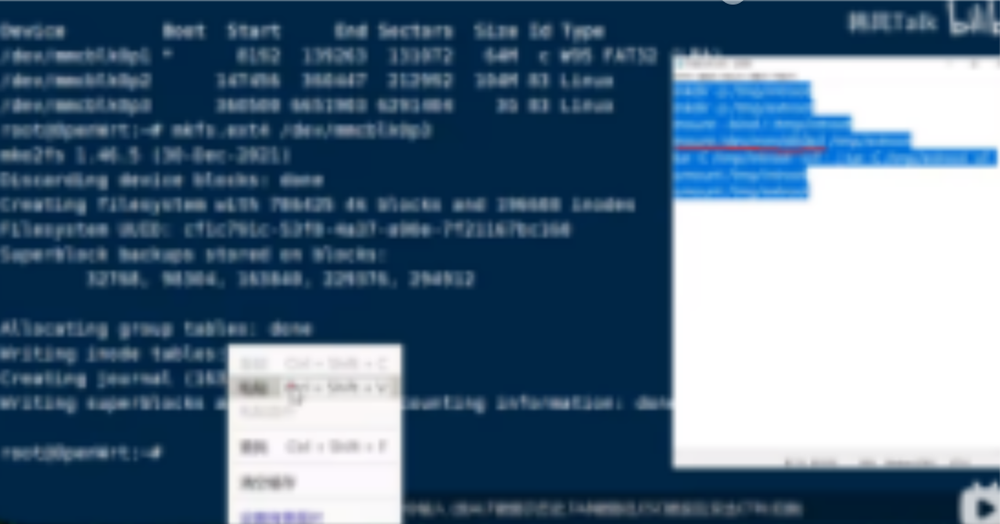
	- #### 直接扩容原来的分区
		- 
			- 需要用到三个插件 ***fdisk*** ***resize2fs*** ***losetup***
				- 查看硬盘分区情况
					- 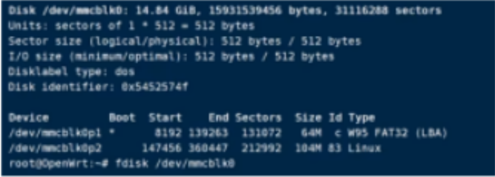
				- 注意第二分区开始数值
				  collapsed:: true
					- 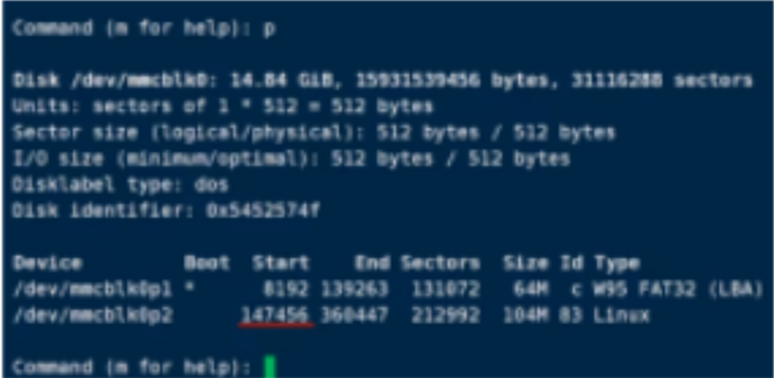
				- 删除第二分区，新建主分区，开始数值必须为原分区开始数值
				  collapsed:: true
					- 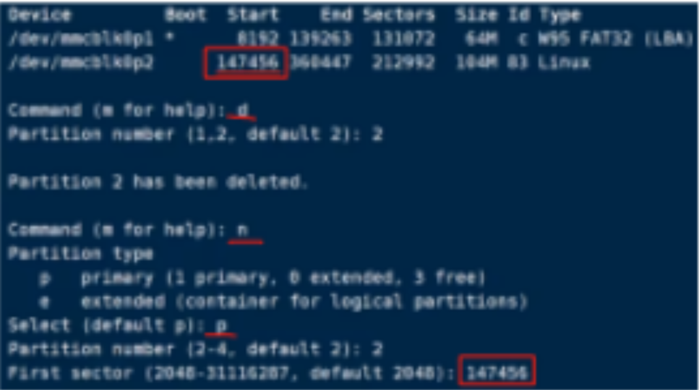
				- 注意，不要移除原分区签名
				  collapsed:: true
					- 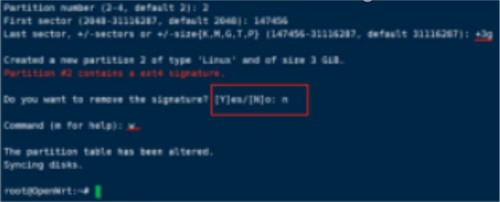
				- 用losetup挂载空循环设备到第二分区，并用resize2fs完成分区扩容
				  collapsed:: true
					- 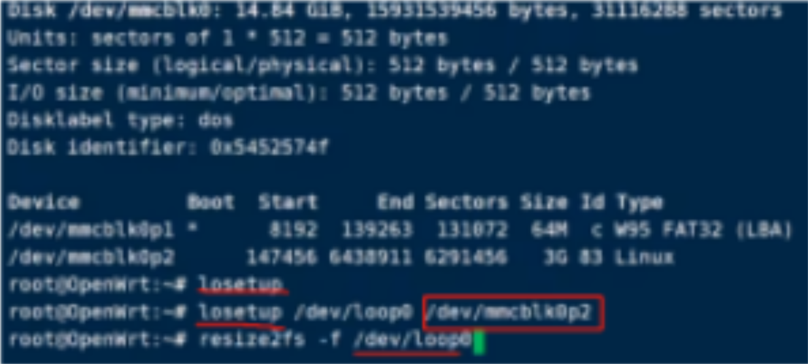
					-
- ### SQUASHFS固件
  collapsed:: true
	- 
	- 需要用到两个插件  ***fdisk***  ***resize2fs***
		- 查看分区情况，注意循环设备盘符
			- 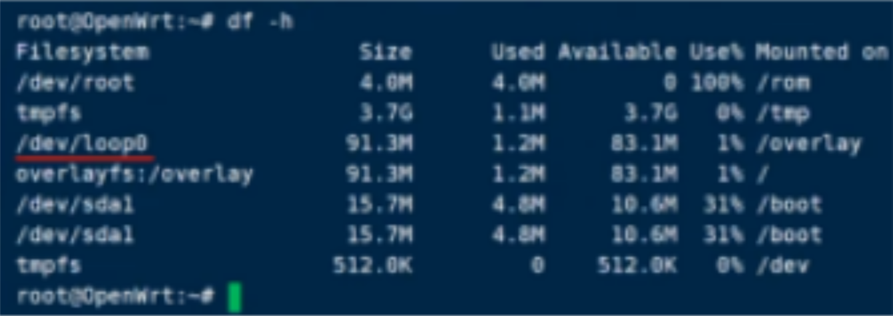
		- 删除原第二分区，并新建分区（注意第二分区的开始值）
			- 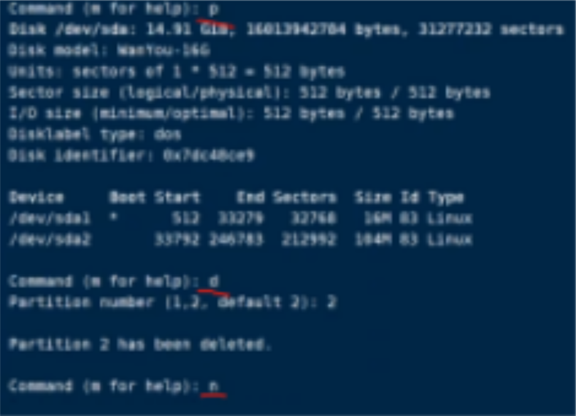
		- 新建主分区，输入原第二分区开始值，并存盘
			- 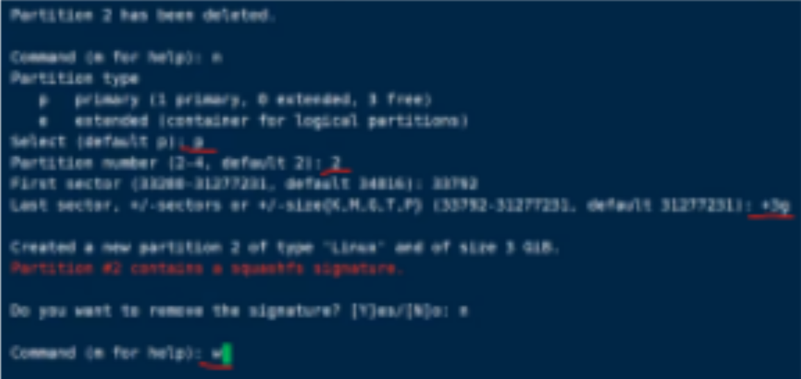
		- 用resize2fs扩容循环设备
			- 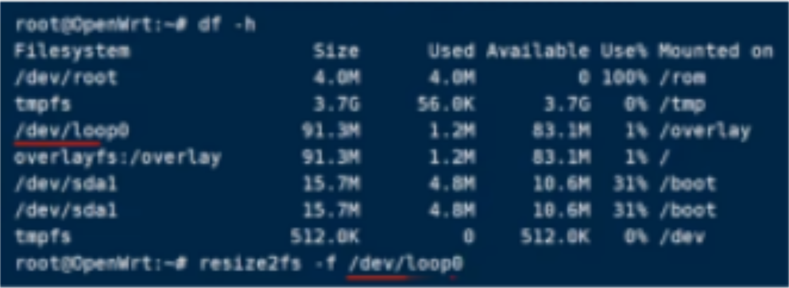
- ### UEFI格式的硬盘
  collapsed:: true
	- BLKID插件
		- 查看第二分区的UUID号
		  collapsed:: true
			- 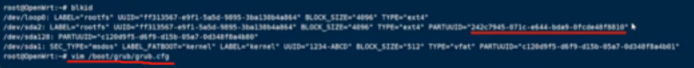{:height 76, :width 688}
		- 修改grub.cfg
		  collapsed:: true
			- 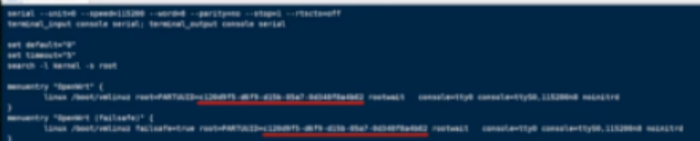