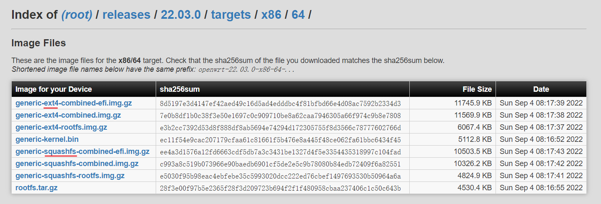
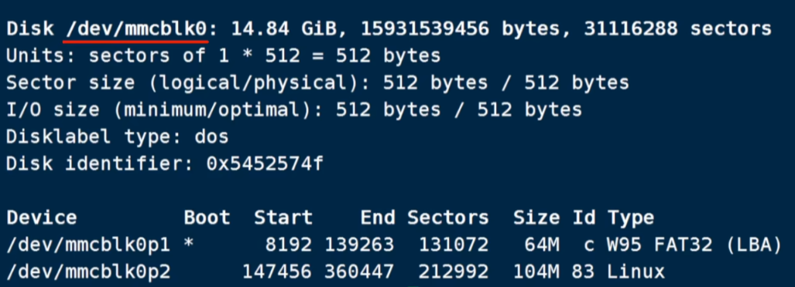
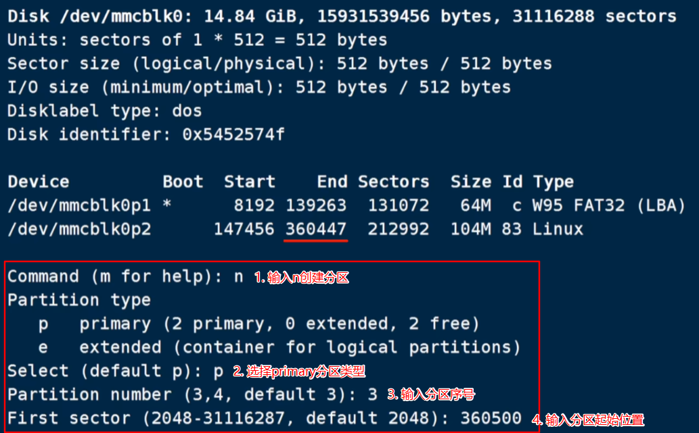

- [OpenWrt软路由空间扩容_openwrt 扩容-CSDN博客](https://blog.csdn.net/ls0111/article/details/128769859)
  tags:: [[SendToLogseq]]
	- #### 文章目录
		- 预备知识
		- * OpenWrt系统固件分类
		  * EXT4固件扩容方式
		  * * 新建分区扩容
		  * * 操作步骤
		  * 直接扩容
		  * * 操作步骤
		  * SQUASHFS固件扩容方式
		  * * 新建分区扩容
		  * 直接扩容
		  * EFI引导固件的额外操作
		  * 参考
	- ## 预备知识
	- ### OpenWrt系统固件分类
		- EXT4固件
		  logseq.order-list-type:: number
		  固件包名称中包含有`ext4`关键字，可以参考`固件分类关键字示意图`图片。该种类型的固件硬盘空间划分如下：
		  
		- SQUASHFS固件
		  logseq.order-list-type:: number
		  固件包名称中包含有`squashfs`关键字，同样参考`固件分类关键字示意图`图片。该种类型的固件硬盘空间划分如下：
		  
	- **固件分类关键字示意图：**
	- 
	- ### EXT4固件扩容方式
	- #### 新建分区扩容
	- 新建分区，将根目录挂载到新分区；（推荐)
	- 在未格式化区域创建新分区，然后将原来系统文件分区的所有内容拷贝到新分区，最后将系统根目录默认挂载点变成新分区即可。
	- 
	- ##### 操作步骤
		- 查看当前磁盘信息
		  logseq.order-list-type:: number
		  ```shell
		  fdisk -l
		  ```
		  
		- 创建新分区
		  logseq.order-list-type:: number
		  id:: 8dc77543-c4d5-465e-a1d2-9d3df7060653
		  ```shell
		  # 注意fdisk后参数是磁盘名称，是要根据实际情况填写
		  fdisk /dev/mmcblk0
		  # 输入p查看分区情况
		  p
		  # 输入n创建新分区
		  n
		  # 选择p，primary分区类型
		  p
		  # 选择分区序号，根据实际情况填写了，一般默认即可
		  # 输入分区起始位置，需要大于红色下划线数字
		  # 输入要创建的分区大小，例如要创建3GB，可以输入+3G即可
		  # 最后输入w写入磁盘
		  ```
		   {:width 680 :height 119}
		- 查看分区效果
		  logseq.order-list-type:: number
		  ```shell
		  fdisk -l
		  ```
		  {:width 680 :height 96}
		- 格式化分区
		  logseq.order-list-type:: number
		  ```shell
		  # mkfs.ext4后参数为新分区名称
		  mkfs.ext4 /dev/mmcblk0p3
		  ```
		- 网页登录openwrt，选择系统挂载点，选择添加
		  logseq.order-list-type:: number
		  {:width 680 :height 189}
		- 选择新创建的分区，并挂载至根目录，保存后应用
		  logseq.order-list-type:: number
		  {:width 680 :height 398}
		- 复制`根目录准备`区域的命令如下
		  logseq.order-list-type:: number
		  ```shell
		  mkdir -p /tmp/introot
		  mkdir -p /tmp/extroot
		  mount --bind / /tmp/introot
		  # mount命令后参数为新分区，该博客中的例子为/dev/mmcblk0p3
		  mount /dev/sda1 /tmp/extroot
		  tar -C /tmp/introot -cvf - . | tar -C /tmp/extroot -xf -
		  umount /tmp/introot
		  umount /tmp/extroot
		  ```
		- 将上述命令在命令行中粘贴执行
		  logseq.order-list-type:: number
		- 若固件带有`efi` 关键字，需要参考`EFI引导固件的额外操作`章节执行额外步骤（可选：仅固件中包含efi关键字需要执行）
		  logseq.order-list-type:: number
		- 重启软路由
		  logseq.order-list-type:: number
	- ````
	  ```shell
	  ````
	- ````
	  reboot
	  ```
	  ````
	- #### 直接扩容
	- 直接将原有根分区扩容，如下图：
	- {:width 640 :height 167}
	- ##### 操作步骤
		- 删除旧分区（需要记住旧分区的磁盘起始位置，如图下划线位置），并创建新分区
		  logseq.order-list-type:: number
		  ```shell
		  # 注意fdisk后参数是磁盘名称，是要根据实际情况填写
		  fdisk /dev/mmcblk0
		  # 删除第2个分区，输入d
		  d
		  # 选择第2个分区，根据实际情况填写
		  2
		  # 输入n创建新分区
		  n
		  # 选择primary分区类型
		  p
		  # 分区编号选择2，一般默认即可
		  2
		  # 输入分区起始位置，该位置要与删除分区的起始位置相同
		  # 输入创建分区大小，例如+3G
		  # 不要删除标识！不要删除标识！不要删除标识！选择n！
		  n
		  # 输入w写入磁盘
		  w
		  ```
		  {:width 680 :height 380}
		  {:width 680 :height 200}
		- 查看分区效果
		  logseq.order-list-type:: number
		  ```shell
		  fdisk -l
		  ```
		  {:width 680 :height 73}
		- 设置循环设备
		  logseq.order-list-type:: number
		  ```shell
		  losetup /dev/loop0 /dev/mmcblk0p2
		  ```
		- 扩展磁盘空间
		  logseq.order-list-type:: number
		  ```shell
		  resize2fs -f /dev/loop0
		  ```
		- 若固件带有`efi` 关键字，需要参考`EFI引导固件的额外操作`章节执行额外步骤（可选：仅固件中包含efi关键字需要执行）
		  logseq.order-list-type:: number
		- 重启软路由
		  logseq.order-list-type:: number
		  ```shell
		  reboot
		  ```
	- ### SQUASHFS固件扩容方式
	- #### 新建分区扩容
	- 由于SQUASHFS固件安装后，会自动创建rom空间，所以可以直接扩容即可。
	- #### 直接扩容
	- 直接扩容方式与ext4固件扩容方式相同，可以参考上述步骤。同样的，需要区分x86设备efi固件。特殊操作上文中也有提及，可以参考。
	- ### EFI引导固件的额外操作
		- 查看分区ID
		  logseq.order-list-type:: number
		  ```shell
		  blkid
		  ```
		  {:width 680 :height 67}
		- 修改系统引导
		  logseq.order-list-type:: number
		  ```shell
		  # 编辑grub.cf文件
		  vi /boot/grub/grub.cfg
		  # 将下划线的两个分区ID修改成新分区的UUID即可
		  ```
		  {:width 680 :height 126}
		- 保存文件
		  logseq.order-list-type:: number
		  ```shell
		  # 输入:wq即可，或者Shift + ZZ快捷键保存均可
		  ```
	- ### 参考
		- OpenWrt的空间扩容问题，可以这么直接解决！
		  logseq.order-list-type:: number
-