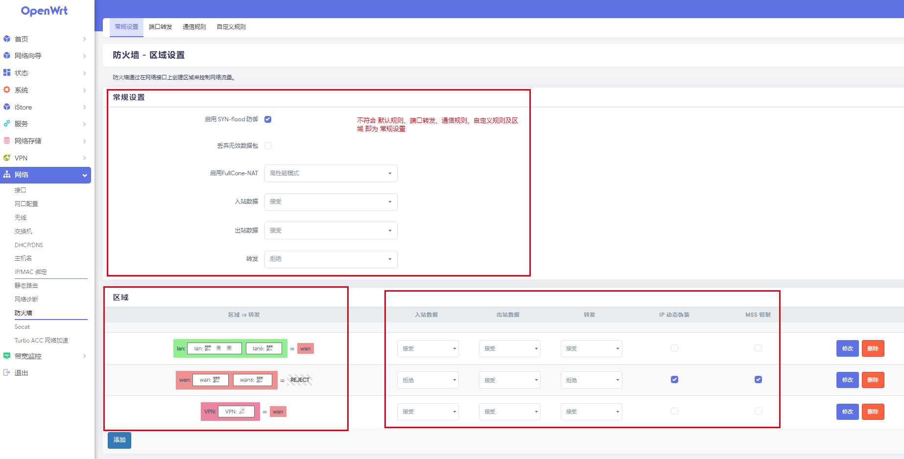

- {:height 404, :width 780}
- ## 通信规则  设置方向
	- ***出站***
		- 源：设备
		  目标：区域
	- ***入站***
		- 源：区域
		  目标：设备
	- ***区域间转发***
		- 源：区域
		  目标：区域
	- ***区域内转发***
		- 源：同一区域
		  目标：同一区域
-
- *注：可参考链接 https://zt0729.xyz/archives/56/ *
-