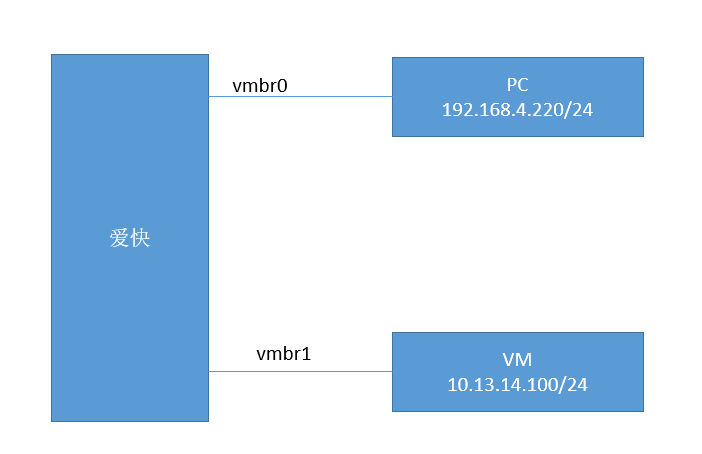
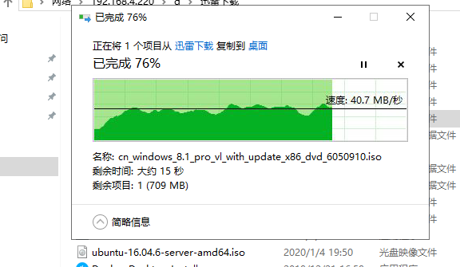
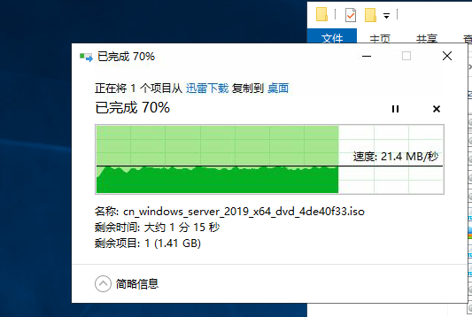
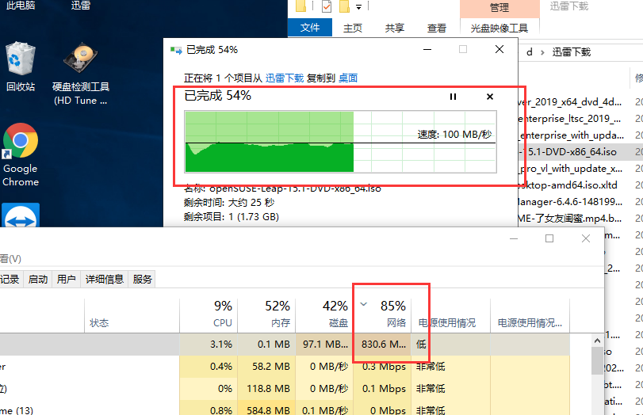

- [佛西博客 - PVE中ikuai爱快软路由网卡/E1000/virtio/vmxnet性能对比](https://foxi.buduanwang.vip/virtualization/531.html/)
  tags:: [[SendToLogseq]]
	- 2022.5.10更新。
	- 下面是一个关于Proxmox VE，e1000\vmxnet3\r8139\virtio-net的性能测试报告，请参考。
	- Proxmox VE 4种网卡性能测试
	- 喜欢用爱快作为网关。这里做一个爱快的软路由网卡性能测试
	- 环境：ikuai\_32位\_4c\_512M
	  网络1：vmbr0==>>桥接的是r8111 千兆网卡
	  网络2：vmbr1 ==>>桥接的是10G网卡
	  设备1：自己的电脑
	  设备2：vm虚拟机。使用的vmbr1（virtio）
	- 测试内容为SMB共享。
	- 网络环境如下
	- 
	- ## 1、网卡为e1000
	- 速度平均在40m/s
	- 
	- ## 2、网卡为vmxnet3
	- 平均20M/s
	- 
	- ## 3、网卡为virtio
	- 惊艳！完全满速！
	- 
-