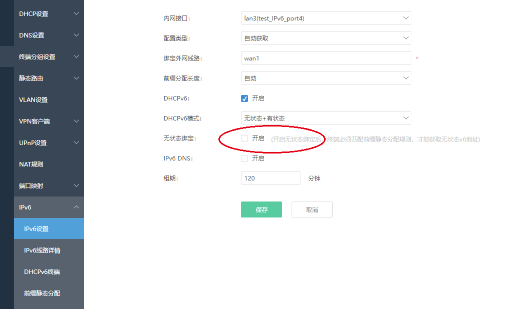
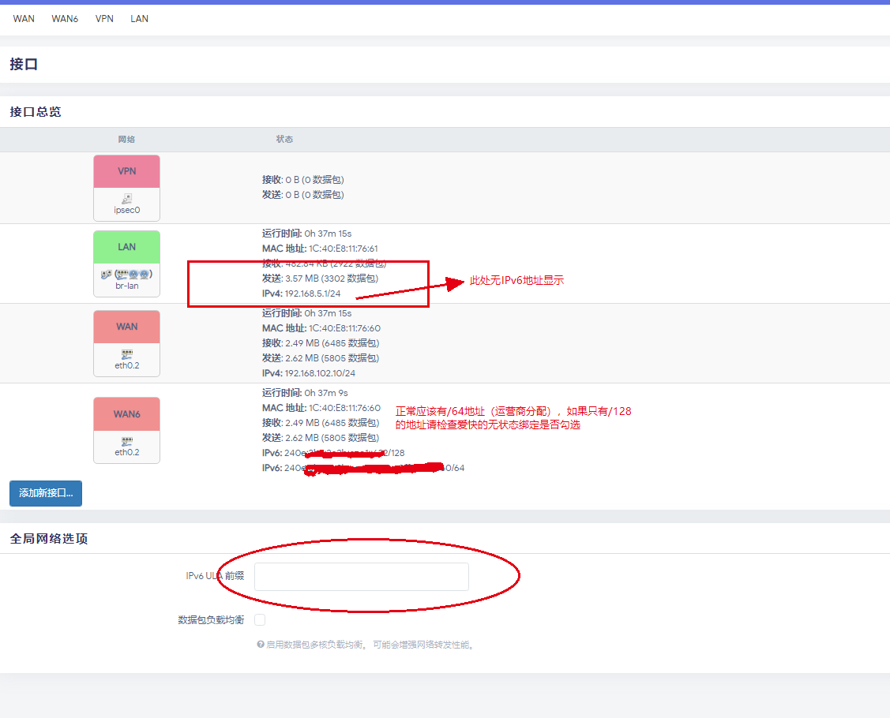
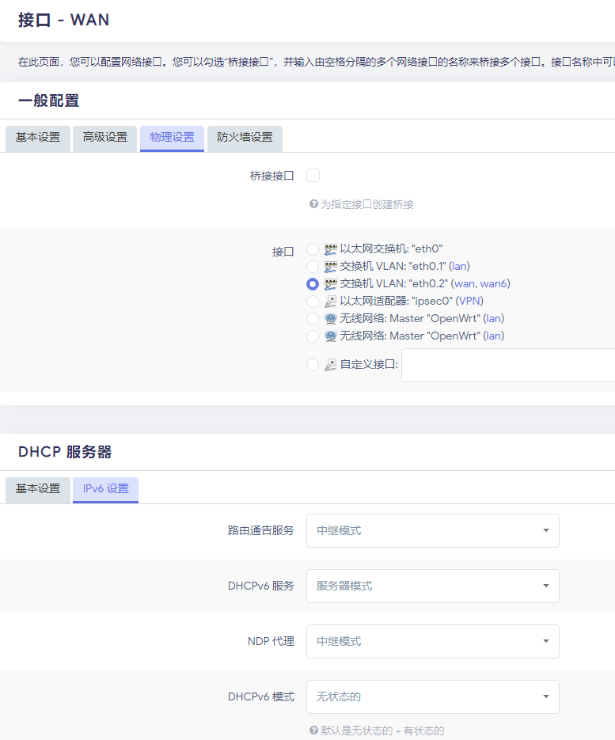
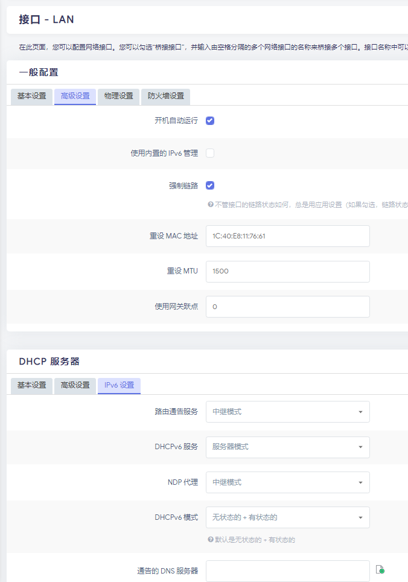
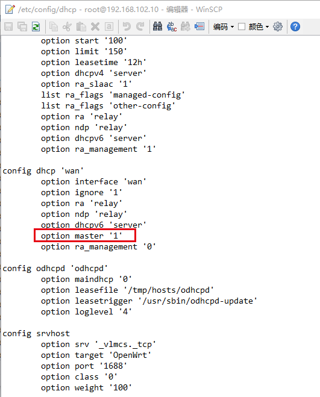

-
- ## 爱快设置
	- 版本：免费版 3.7.4 x32 Build202307111447
		- 
			- *注：一定要将无状态绑定取消勾选，否则二级OpenWRT仅能获取/128的IPv6地址，相当于在爱快层面的**NAT6**，终端不会有公网的IPv6地址，只有内网的IPv6，使用内网的IPv6地址访问ipv6资源时，路由器会自动将内网IPV6地址转为wan口的公网IPV6地址。*
- ## OpenWRT 设置
	- 版本：P&W R619AC 128M OpenWrt R23.6.6 LuCI Master (git-23.163.54516-50f4225) LEAN
	- 正常显示
		- 
	- ### WAN口设置
		- 
	- ### LAN口设置
		- 
	- ### 添加额外配置
		- 
			- *注：因为图形化配置上没有这个配置项，所以需要在命令下配置，通过ssh连接工具连到路由器修改*
-
- ## IPv6基础
  
  IPv6地址自动配置的三种基本形式：
  1）Stateless无状态的。 这个过程是 “无状态的”，原因是它不依赖于外部分配机制（例如IPv6动态主机配置协议（DHCPv6））的状态或是否存在。 在没有外部或用户干预的情况下， 设备尝试配置其自身的IPv6地址 （可能是多个地址）。
  2）Stateful有状态的。 有状态的过程仅依赖于外部地址分配机制（例如DHCPv6）。DHCPv6服务器以类似于IPv4 DHCP操作的方式，将128bit IPv6地址分配给设备。
  3）Stateless+Stateful无状态和有状态组合方式。 这个过程涉及无状态地址自动配置与其他IP参数的有状态配置相结合一起使用的形式。 通常情况下， 这需要一台设备使用无状态方法自动配置一个IPv6地址，之后利用DHCPv6得到其他参数或选项，比如要在给定网络上联系哪台NTP服务器来查询时间分辨率。
  
  \* 无状态使用无状态地址自动配置 (SLAAC, Stateless address Autoconfiguration)
  \* 有状态使用IPv6动态主机配置协议 (DHCPv6, Dynamic Host Configuration Protocol for IPv6)
  \* 无状态+有状态使用SLAAC自动配置IPv6地址，使用DHCPv6获取DNS等其他信息。
  
  有状态、无状态都是自动地址配置，不管有状态还是无状态，网关都只包含在服务端发送的RA信息中的，DNS可包含在服务端RA中，也可由服务端DHCPv6分配
  
  OpenWRT完整的支持IPv6须安装odhcp6c odhcpd ip6tables luci-proto-ipv6安装包，如果安卓设备不能正常获取IPv6可以将DHCPv6模式改为无状态
  
  *注：fe80 是本地链路，只用来和路由器直接 通信，剩余两个都是通过分发前缀生成的，一个是基于EUI64用网卡的MAC生成，是基于网卡固定的 一般为/64*
  
  *另一个是隐私保护地址，后缀是随机生成，有效期短些，是用来对外发起访问的r所以一般动态域名都绑定这个地址 /128*
-