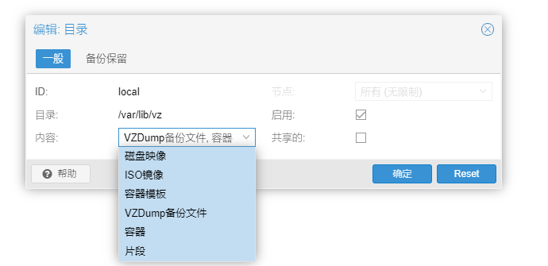

- [佛西博客 - PVE的local和local-lvm](https://foxi.buduanwang.vip/virtualization/pve/1434.html/)
  tags:: [[SendToLogseq]]
	- 对于刚接触pve的童鞋来说，会对这2个存储点产生相当大的疑问。
	- ## PVE的主分区结构
	- 首先我们看下pve的默认安装磁盘，是一个基于LVM的结构
	- ```
	  root@pve:~# fdisk -l
	  Disk /dev/sda: 80 GiB, 85899345920 bytes, 167772160 sectors
	  。。。
	  Device       Start       End   Sectors  Size Type
	  /dev/sda1       34      2047      2014 1007K BIOS boot
	  /dev/sda2     2048   1050623   1048576  512M EFI System
	  /dev/sda3  1050624 167772126 166721503 79.5G Linux LVM
	  ```
	- 其中
		- pve-root           作为根目录
		- pve-swap         作为虚拟内存
		- pve-data          作为磁盘镜像储存
	- ```
	  
	  root@pve:~# lsblk
	  NAME               MAJ:MIN RM    SIZE RO TYPE MOUNTPOINT
	  sda                  8:0    0     80G  0 disk 
	  ├─sda1               8:1    0   1007K  0 part 
	  ├─sda2               8:2    0    512M  0 part 
	  └─sda3               8:3    0   79.5G  0 part 
	  ├─pve-swap       253:0    0      4G  0 lvm  [SWAP]
	  ├─pve-root       253:1    0   19.8G  0 lvm  /
	  ├─pve-data_tmeta 253:2    0      1G  0 lvm  
	  │ └─pve-data     253:4    0   43.9G  0 lvm  
	  └─pve-data_tdata 253:3    0   43.9G  0 lvm  
	    └─pve-data     253:4    0   43.9G  0 lvm
	  ```
	- ## lvm-data
	- 而LVM之中，还建了一个thinpool，名为data。
	- 什么叫lvm-thin可以参考LVM存储虚拟化\_Thin-provisioned.pdf-原创力文档 (book118.com)
	- 使用lvm-thin可以实现类似于vSphere的精简置备，还可以进行快照，很方便调整空间。
	- ```
	  root@pve:~# lvs
	  LV   VG  Attr       LSize  Pool Origin Data%  Meta%  Move Log Cpy%Sync Convert
	  data pve twi-a-tz-- 43.87g             0.00   1.59                            
	  root pve -wi-ao---- 19.75g                                                    
	  swap pve -wi-ao----  4.00g
	  ```
	- 但是lvm-thin有一个不友好的地方。虚拟机储存到lvm-thin，是作为块设备。所以不能直接拷贝文件到其他地方去做备份或者迁移。
	- ## local
	- 通过查看存储配置文件，观察到local是做为一个dir类型的目录，用来存放iso，备份文件；local-lvm是lvmthin，用来存储虚拟机磁盘。
	- ```
	  root@pve:~# cat /etc/pve/storage.cfg 
	  dir: local
	        path /var/lib/vz
	        content iso,vztmpl,backup
	  
	  lvmthin: local-lvm
	        thinpool data
	        vgname pve
	        content rootdir,images
	  ```
	- 因为是lvm，那么其实可以动态调整磁盘空间，例如根目录小了，可以缩小lvm-thin的空间，然后扩大到根目录。
	- ## 删除lvm-thin
	- 由于qcow2的优秀，且属于文件类型，所以并不建议使用lvm-thin作为其存储底层。
	- 这里给一教程，删除local-lvm，并且将所有空间给到pve-root。
	- 注意！请先确保自己的虚拟机没有位于lvm-thin上，若有，请先移动到local
	- 编辑local，勾选所有内容，并确认。就
	- 
	- 可以在虚拟机配置栏，选择磁盘，点击移动磁盘到其他磁盘上就行。
	- 使用命令删除lvm-thin `lvremove /dev/pve/data`，
	- ```
	  root@pve:~# lvremove /dev/pve/data 
	  Do you really want to remove active logical volume pve/data? [y/n]: y 
	  Logical volume "data" successfully removed
	  ```
	- 再将lvm-thin的空间转移到pve-root，使用命令`lvextend -rl +100%FREE /dev/pve/root`
	- ```
	  root@pve:~# lvextend -rl +100%FREE /dev/pve/root
	  Rounding size to boundary between physical extents: 43.87 GiB.
	  Size of logical volume pve/root changed from 19.75 GiB (5056 extents) to 63.62 GiB (16287 extents).
	  Logical volume pve/root successfully resized.
	  ```
	- 使用df -h查看，根目录已经扩大了。
	- ```
	  root@pve:~# df -h
	  Filesystem            Size  Used Avail Use% Mounted on
	  udev                  1.9G     0  1.9G   0% /dev
	  tmpfs                 393M  892K  392M   1% /run
	  /dev/mapper/pve-root   63G  2.4G   58G   5% /
	  tmpfs                 2.0G   43M  1.9G   3% /dev/shm
	  tmpfs                 5.0M     0  5.0M   0% /run/lock
	  /dev/fuse             128M   16K  128M   1% /etc/pve
	  tmpfs                 393M     0  393M   0% /run/user/0
	  ```
	- 当然删除了lvm-thin之后，还要修改一下储存配置。
	- 在网页上，删除lvm-thin
	- {:width 1061 :height 239}
	- 这样做了，我们就可以进入目录
	- /var/lib/vz查看所有的内容了。
	- ```
	  t@pve:~# tree /var/lib/vz/
	  /var/lib/vz/
	  ├── dump        --备份文件
	  ├── images      --虚拟机磁盘
	  ├── private
	  ├── snippets    --片段
	  └── template   
	    ├── cache     --容器模板
	    ├── iso          --iso
	    └── qemu
	  ```
-