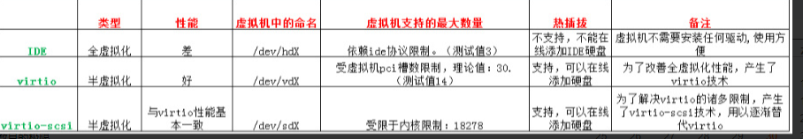
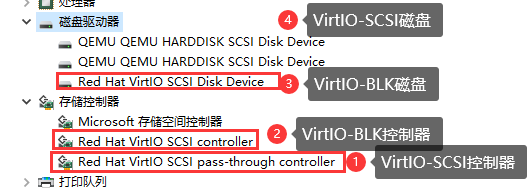

- [佛西博客 - Proxmox VE 虚拟机磁盘的选择](https://foxi.buduanwang.vip/virtualization/1214.html/)
  tags:: [[SendToLogseq]]
	- 这么多类型？怎么选才能让PVE的磁盘性能得到最优的结果？
	- 
	- **先说一下基本的概念吧。**
		- VirtIO Block:
		  一种很好的半虚拟化磁盘驱动
		- VirtIO SCSI:
		  VirtIO block优化后的半虚拟化磁盘驱动
		- VirtIO SCSI Single:
		  和VirtIO SCSI一样，只不过一个SCSI磁盘对应一个VirtIO的控制器
	- **那3者有什么区别呢？**
	- 当然是VirtIO-SCSI性能比VirtIO-Block性能好
	- 参考：https://www.ovirt.org/develop/release-management/features/storage/virtio-scsi.html
	- virtio-scsi 功能是一种新的半虚拟化 SCSI 控制器设备。它是 KVM 虚拟化存储堆栈替代 virtio-blk 并改进其功能的替代存储实施的基础。它提供与 virtio-blk 相同的性能，并增加了以下直接好处：
		- 改进的可扩展性——虚拟机可以连接到更多的存储设备（virtio-scsi 可以处理每个虚拟 SCSI 适配器的多个块设备）。
		- 标准命令集——virtio-scsi 使用标准 SCSI 命令集，简化了新功能的添加。
		- 标准设备命名——virtio-scsi 磁盘使用与裸机系统相同的路径。这简化了物理到虚拟和虚拟到虚拟的迁移。
		- SCSI 设备直通——virtio-scsi 可以将物理存储设备直接呈现给来宾。
	- 与 virtio-blk 相比，Virtio-SCSI 提供了直接连接到 SCSI LUN 的能力，并显着提高了可扩展性。virtio-SCSI 的优势在于它能够处理数百个设备，而 virtio-blk 只能处理大约 30 个设备并耗尽 PCI 插槽。
	- virtio-scsi 旨在取代 virtio-blk，保留了 virtio-blk 的性能优势，同时提高了存储可扩展性，允许通过单个控制器访问多个存储设备，并能够重用客户操作系统的 SCSI 堆栈。
	- 简要的可以参考下图
	- 
	- 引用于：https://www.cnblogs.com/kylingx/p/11704994.html
	- 从实际上看
	- 我们创建一个虚拟机，使用VirtIO SCSI控制器，创建了2个SCSI设备，一个VirtIO BLK设备。
	- 
	- 在系统下可以看到如下信息
	- 
	- 从上面的信息来看，
	- VirtIO BLK是有独立的磁盘控制器的，叫做：Red Hat VirtIO Scsi controller。
	  VirtIO SCSI控制器名字叫做：Red Hat VirtIO SCSI pass-through contoller
	- VirtIO BLK磁盘名叫做：Red Hat SCSI Disk Device
	  VirtIO SCSI磁盘名叫做：QEMU QEMU HARDDISK SCSI Disk Device
	-  然后我们将磁盘控制器改成VirtIO-SCSI-Single
	- 在OS上面再次看
	- 
	- 显而易见，VirtIO-SCSI-Single控制器，是一个SCSI磁盘对应一个控制器，这样可以提高性能
	- 
	- 有个明显的例子如下https://c.cra.moe/t/topic/24
	- 
	- 这边跑了个数据
	- 
	- 上面是VirtIO-SCSI-Single模式，下面是普通的VirtIO-SCSI模式
	- 
	- 两者看起来差距不大。但是从理论上，还是single模式效益高点。
	- 所以总目前的结论来看，在PVE中要发挥最大的磁盘性能，建议使用VirtIO-SCSI-Single模式的SCSI硬盘。
-