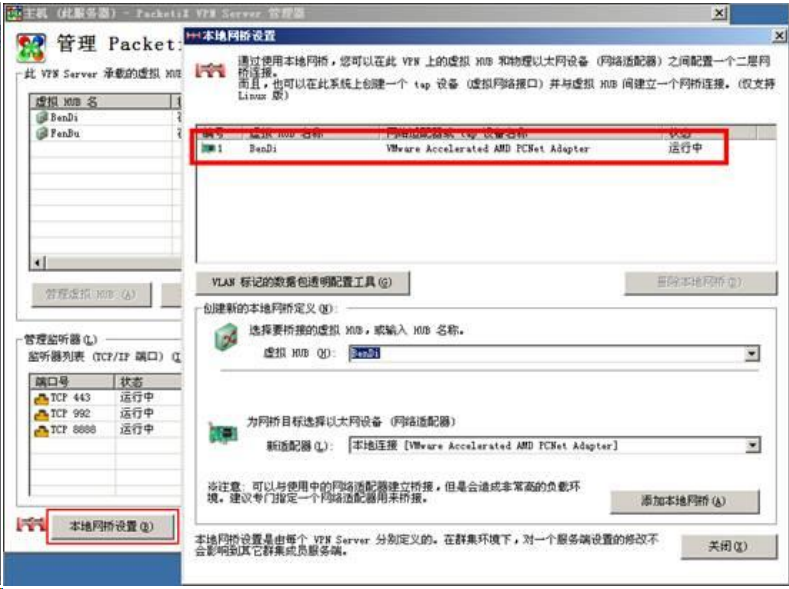

# Softether 端对端连接思路
- ## 总部与分部使用不同的IP网段
  
- 要实现两个局域网不同IP网段的通信，需要使用VPN Server的3层交换功能，
  
  比如总部网络使用192.168.1.0网段，分部使用192.168.2.0网段。
- ### 1 总部端
- ##### 1.1 新建两个虚拟HUB，分别为BenDi及FenBu
- 
- ##### 1.1.1 【本地网桥设置】选择BenDi (本地)虚拟HUB和网卡
- ######  虚拟HUB建立与总部网络的连接，点击【本地网桥设置】，选择【BenDi】虚拟HUB和网卡，点击【**添加本地网桥**】：
- 
- ##### 1.1.2 FenBu（分部）创建用户密码
- ###### 虚拟HUB负责Bridge端(分部网络)的VPN连接，进入到【FenBu】虚拟HUB的管理，点击【**管理用户**】，创建用户和密码，
- 
- ##### 1.1.3 创建3层交换机并设定本地总部段IP（192.168.1.x）及分部段IP（192.168.2.x）
  
  **创建3层交换机【route】**
  
  
- 点击3层交换机的【编辑】按钮，**为【BenDi】和【FenBu】虚拟HUB添加虚拟接口**
  
  
  
  
- ### 2 分部端
  
  
- #### 2.1 【Bridge端】，默认有一个【BRIDGE】虚拟HUB，负责与物理局域网的桥接，和到总部的VPN连接
  
  **与物理局域网的桥接**
  
  
  
  
  
  
  
  **管理级联连接**
  
  
- ### 3 静态路由
  
  **总部路由器上添加：192.168.2.0 255.255.255.0 下一跳192.168.1.254.**
  
  **分部路由器上添加：192.168.1.0 255.255.255.0 下一跳192.168.2.254.**
- ## 特别说明
  
  1、图片来源于网络，因项目实施过程中不方便截图，只能通过网络补图；
  
  2、总部端须有公网IP，动态公网也行配合动态DDNS绑定域名即可 ；
  
  3、softether的动态 dns 在电信网络经常被解析为127.0.0.1，须通过其它第三方动态DDNS实现
-
-
-
-
-
-