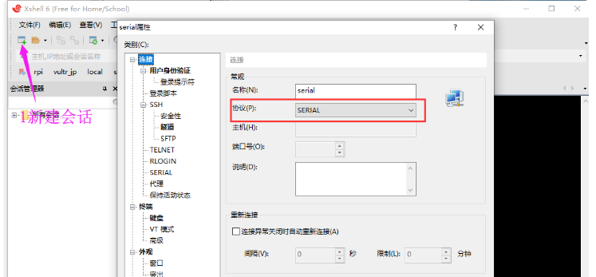
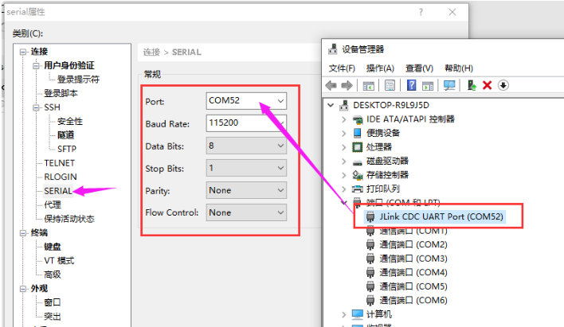
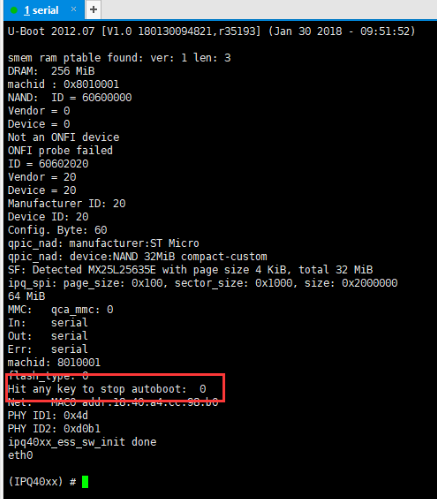
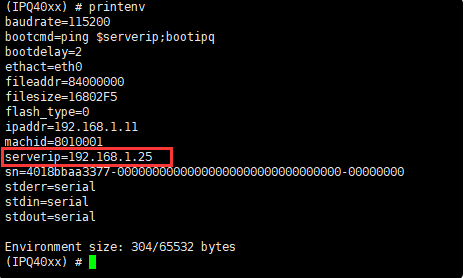
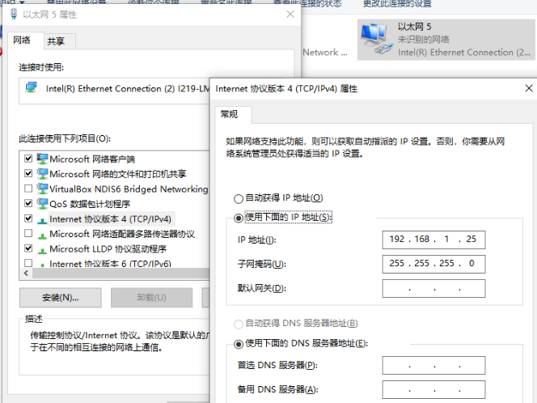
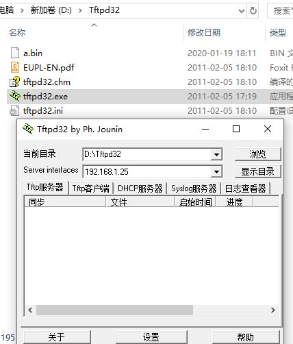
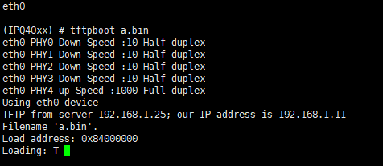
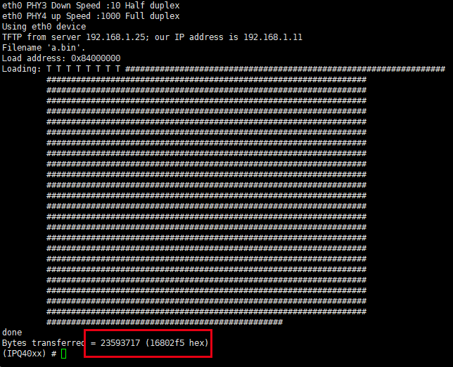
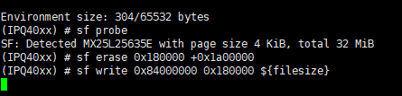

## 思路
	- ### 连接TTL，GND接GND、路由器[[$green]]==RX==接TTL的[[$green]]==TX==、路由器[[$red]]==TX==接TTL的[[$red]]==RX==，也就是 **RX和TX反过来接**
	  logseq.order-list-type:: number
	  collapsed:: true
		- 软件设置
		  logseq.order-list-type:: number
			- 
			- 
			-
	- ### 路由器重新上电可看到正常显示启动数据，在启动倒数几秒内按对应的快捷键中断启动
	  logseq.order-list-type:: number
	  collapsed:: true
		- 
		  collapsed:: true
			- *竞斗云为不停的敲F键和Enter键）进入bootloader，我们要在这个模式里面进行刷机*
	- ### 通过TFTP上传固件写入内存
	  logseq.order-list-type:: number
		- 先连接网线到电脑，然后输入”printenv”命令查看 U-Boot 中的serverip IP 地址信息，ipaddr 表示 U-Boot 即路由使用的 IP 地址，serverip 表示服务器即 PC 机使用的 IP 地址**”192.168.1.25″**
		  logseq.order-list-type:: number
			- 
		- 在电脑端 网络设置里面设置IPV4地址为TFTP服务器地址**”192.168.1.25″**并确定保存
		  logseq.order-list-type:: number
			- 
		- 打开 TFTPd32，Current Directory 选择要上传文件的目录（一般放在软件目录里），Server interfaces 选择本机跟路由相连的网卡 (参考刚才设置的 IP 地址)
		  logseq.order-list-type:: number
		  collapsed:: true
			- 
		- tftp上传固件：”tftpboot <文件名>”，输入”tftpboot a.bin”，tftpboot 命令用于向 TFTP 服务器请求a.bin文件，并存入内存
		  logseq.order-list-type:: number
		  collapsed:: true
			- 
		- 文件上传完成
		  logseq.order-list-type:: number
		  collapsed:: true
			- 
	- ### 从内存写入QSPI Flash
	  logseq.order-list-type:: number
	  collapsed:: true
		- ***警告：命令需谨慎，以防万一做好备份，ART没了就没灵魂了！！！***
		  logseq.order-list-type:: number
		- *本设备为IPQ4019单SPI FLASH（NAND Flash使用nand 命令烧录），以下使用本设备SPI FLASH为例：*
		  logseq.order-list-type:: number
			- 初始化芯片SPI总线FLASH驱动: “sf probe;”
			  logseq.order-list-type:: number
			- 擦除 Flash，任擦除分区的命令，可以指定偏移off 和大小size 擦除，如果不输入从参数，则整片擦除，但是此命令会跳过坏块，SPI FLASH速度慢可能需要5分钟。”sf erase <flash地址> +<擦除大小>”
			  logseq.order-list-type:: number
			  例如”sf erase 0x180000 +0x1a00000;”-
			- 写内存数据到flash，”sf write <源地址> <目的地址> <长度>”
			  logseq.order-list-type:: number
			  例如：”sf write 0x84000000 0x180000 ${filesize}”
			  把内存0x8400 0000处的数据, 写入flash的偏移0x180000, 写入数据长度为下载文件大小, 操作偏移和长度最小单位是Byte
				- 
			- 重启命令:”reset”
			  logseq.order-list-type:: number