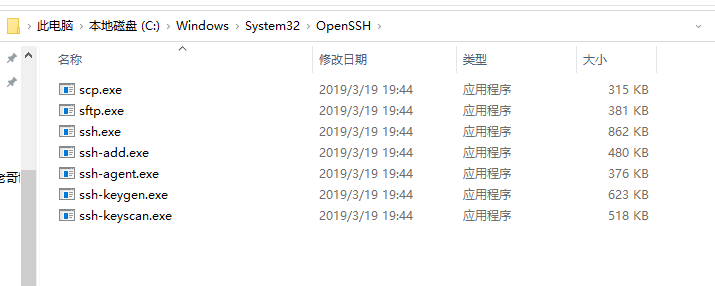
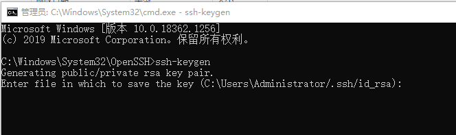
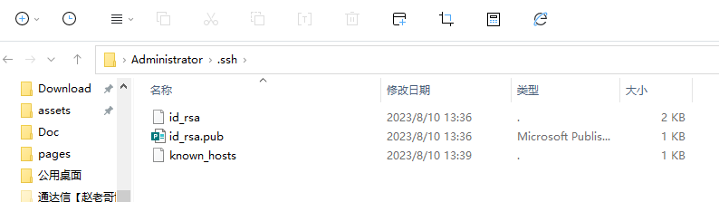
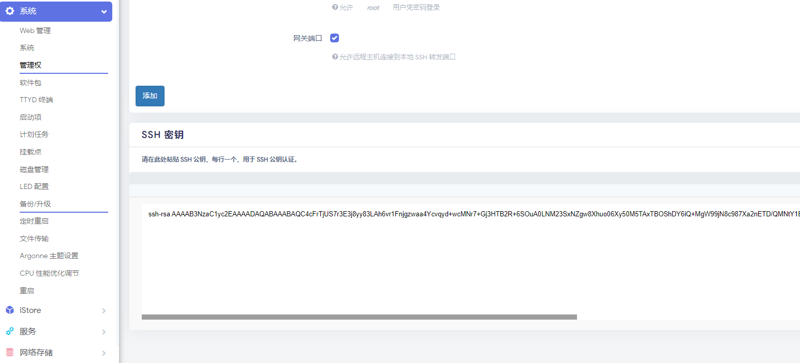
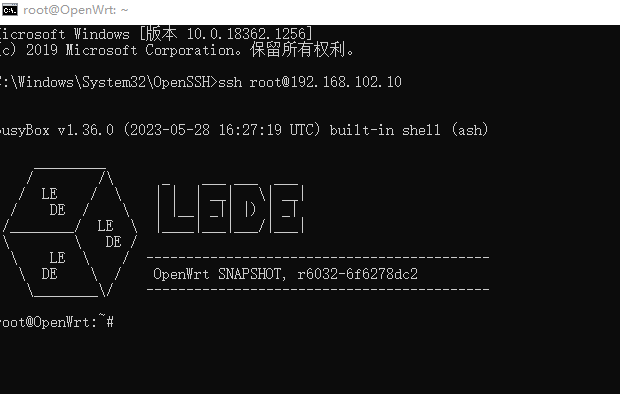
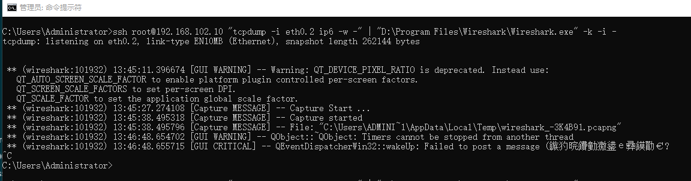
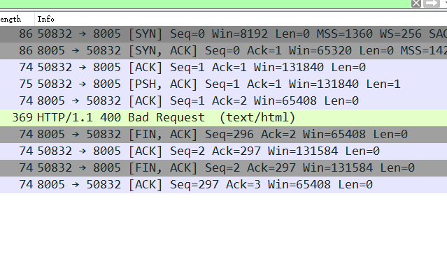
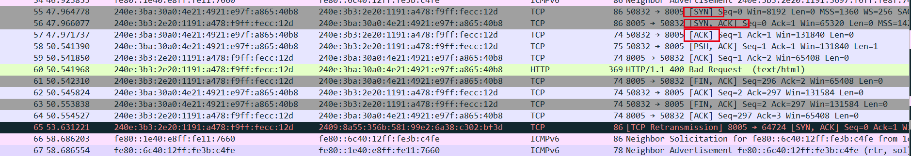
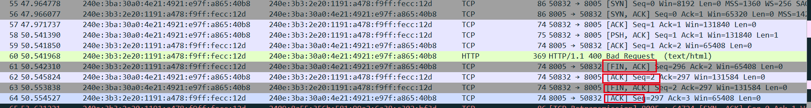

### 思路
	- 1 Windows安装OpenSSH
	- 2 获取Windows公钥
	- 3 将windows公钥复制到openwrt中，实现windwos免密ssh登录
	- 4 windows运行`ssh root@192.168.102.10 "tcpdump -i eth0.2 ip6 -w -" | "D:\Program Files\Wireshark\Wireshark.exe" -k -i -  `
		- tcpdump
			- -i 是指定需要抓取的路由器接口
			- ip6 是指只抓取IPv6协议
			- -w 是指定输出文件，当参数为 - 表示输出到当前stdout
		- Wireshark
			- | 表示管道 stdin从管道中来
			- -i 表示Input 如果参数是- 表示使用当前的stdin
- ### Windows 设置
	- 
	- 
	- 
- ### OpenWRT设置
	- 
- ### 测试
	- 
- ### 实践
	- 
	-
- ### 三次握手 四次挥手
	- 
	- 三次握手
		- 
			- 第一次的标志是“[SYN]”,序列号seq为0， 代表客户端请求建立连接
			   第二次的标志是“[SYN, ACK]”,序列号Seq为0，Ack值为客户端发送过来的Seq加1，也就是1，表示服务器可以正常接收客户端数据包。
			  第三次的标志是“[ACK]”,客户端表示可以正常接收服务器数据包，这是为了保证可以全双工通讯，接下来就可以正常发送数据。
		- 四次挥手
			- 
				- 四次挥手标志分别为：
				- "[FIN, ACK]"
				- "[ACK]"
				- "[FIN, ACK]"
				- "[ACK]"