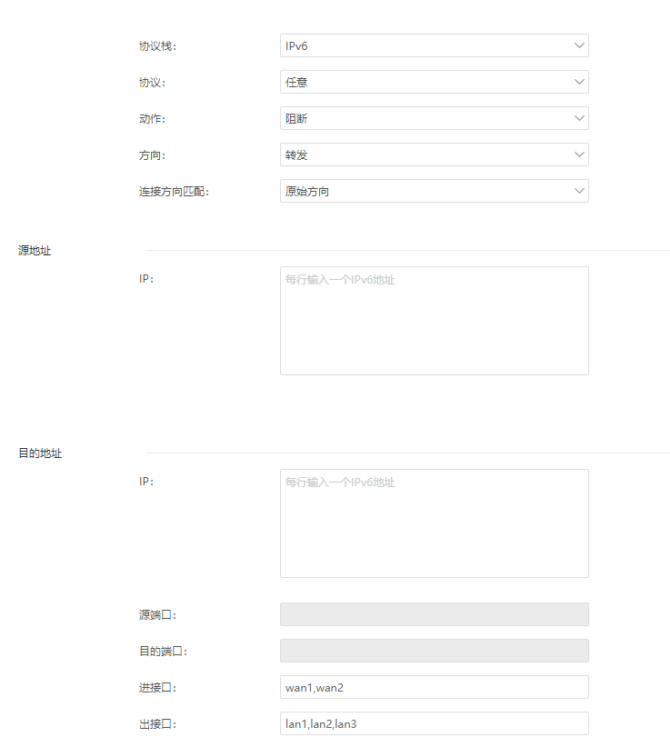

- 在爱快路由3.7.0及以上版本开始支持 IPV6 协议的 ACL 规则
- iKuai 路由器默认并没有开启防火墙，内网的 IPv6 设备确实是[[$green]]==裸奔==在互联网上的
- 本篇配置防火墙的基本规则时**[[$red]]==全局禁入准出==**，**特殊**需要从公网连接的服务**单独设置**准入规则(当ACL规则冲突时[[$red]]==允许的优先级高于阻断的优先级==)。
-
- ## 全局禁入
	- 
		- 【**协议栈**】：**IPv6**
		  logseq.order-list-type:: number
		- 【**协议**】：**任意**
		  logseq.order-list-type:: number
		- 【**动作**】：**阻断**
		  logseq.order-list-type:: number
		- 【**方向**】： **转发**。*(路由器本身可以单独设置是否开启远程管理(默认关闭)，不必再设置 ACL)*
		  logseq.order-list-type:: number
		- 进：内网或外网进路由。
		  logseq.order-list-type:: number
			- 转发：路由接收到内网或外网数据然后把数据进行转发动作。
			  logseq.order-list-type:: number
		- 【**连接方向匹配**】：**原始方向**。哪方**发起连接**哪方便为为**原始方向**，彼方为应答方向。
		  logseq.order-list-type:: number
		- *以下是我的一些猜测：这里一定要仅选"原始方向"，不能选"关闭"或"双向"。因为如果包含了"应答方向"的话，即使内网设备出站放行，但远程服务器的"应答"若被阻断，也仍然无法正常上网。"连接方向"和"访问方"、"被访问方"有关，与"进接口"、"出接口"并没什么大关系，不一定"出接口"就是"被访问方。"*
		  logseq.order-list-type:: number
		- 【**进接口**】和【**出接口**】：一般为 **WAN** 和 **LAN**，根据实际情况选择。
		  logseq.order-list-type:: number
- ## 全局准出
-