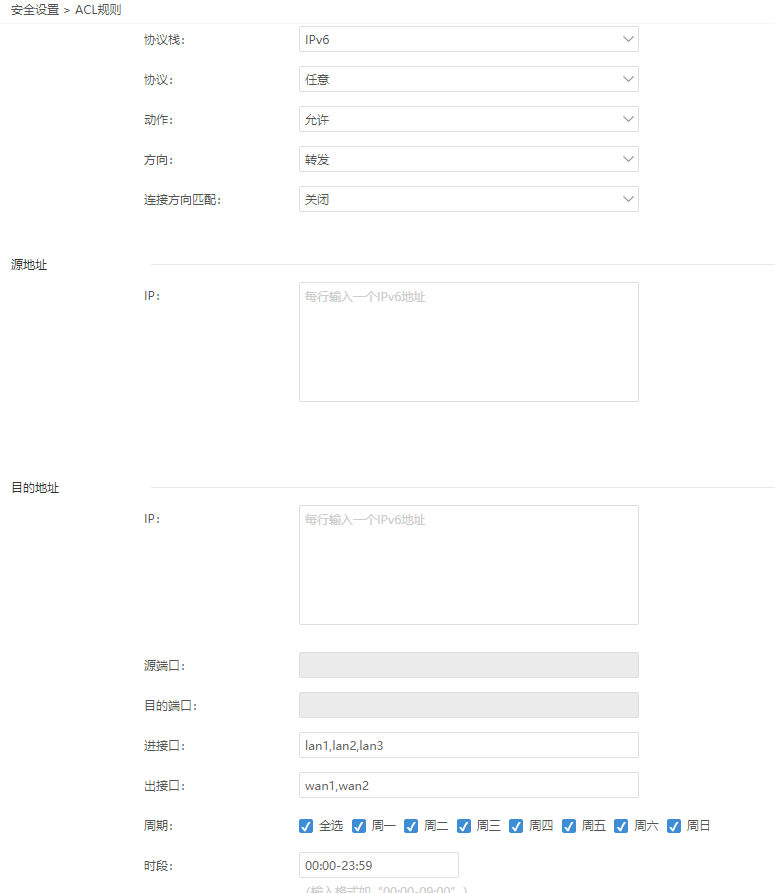
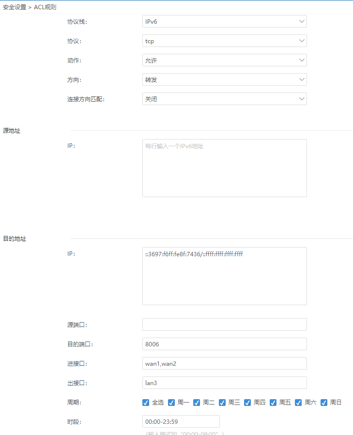

- 在爱快路由3.7.0及以上版本开始支持 IPV6 协议的 ACL 规则
- iKuai 路由器默认并没有开启防火墙，内网的 IPv6 设备确实是[[$green]]==裸奔==在互联网上的
- 本篇配置防火墙的基本规则时**[[$red]]==全局禁入准出==**，**特殊**需要从公网连接的服务**单独设置**准入规则(当ACL规则冲突时[[$red]]==允许的优先级高于阻断的优先级==)。
-
- ## 全局禁入
	- 
		- 【**协议栈**】：**IPv6**
		  logseq.order-list-type:: number
		- 【**协议**】：**任意**
		  logseq.order-list-type:: number
		- 【**动作**】：**阻断**
		  logseq.order-list-type:: number
		- 【**方向**】： **转发**。*(路由器本身可以单独设置是否开启远程管理(默认关闭)，不必再设置 ACL)*
		  logseq.order-list-type:: number
		- 进：内网或外网进路由。
		  logseq.order-list-type:: number
			- 转发：路由接收到内网或外网数据然后把数据进行转发动作。
			  logseq.order-list-type:: number
		- 【**连接方向匹配**】：**原始方向**。哪方**发起连接**哪方便为为**原始方向**，彼方为应答方向。
		  logseq.order-list-type:: number
		- *以下是我的一些猜测：这里一定要仅选"原始方向"，不能选"关闭"或"双向"。因为如果包含了"应答方向"的话，即使内网设备出站放行，但远程服务器的"应答"若被阻断，也仍然无法正常上网。"连接方向"和"访问方"、"被访问方"有关，与"进接口"、"出接口"并没什么大关系，不一定"出接口"就是"被访问方。"*
		  logseq.order-list-type:: number
		- 【**进接口**】和【**出接口**】：一般为 **WAN** 和 **LAN**，根据实际情况选择。
		  logseq.order-list-type:: number
- ## 全局准出
	- 
		- 【**协议栈**】：**IPv6**
		  logseq.order-list-type:: number
		- 【**协议**】：**任意**
		  logseq.order-list-type:: number
		- 【**动作**】：**允许**
		  logseq.order-list-type:: number
		- 【**方向**】： **转发**
		  logseq.order-list-type:: number
		- 【**连接方向匹配**】：**关闭**
		  logseq.order-list-type:: number
			- 网上的教程都是设置为"关闭"，新规则默认选择的也是"关闭"。"关闭"具体是什么效果ikuai的官方文档里也没说。以下是可能的解释：
				- ```
				  "关闭"：这个设置可能意味着ACL规则对数据包的方向不做任何检查或匹配。换句话说，
				  规则将会无视数据包的方向，只根据其它条件（如源IP地址、目标IP地址、协议类型等）来决定
				  是否应用。在某些情况下，"关闭"也可能意味着ACL规则完全不会被应用，但这取决于具体设备或
				  软件的设计。
				  ```
		- 【**进接口**】和【**出接口**】：一般为 **LAN** 和 **WAN**，根据实际情况选择。
		  logseq.order-list-type:: number
- ## ## 准入特定端口
	- 
		- *建立规则**需要目标服务的 IP 地址是确定的**，但 ikuai 尚不支持静态 DHCPv6 也不支持 DHCPv6/EUI-64, 所以只能自谋出路了。目前来看设备使用"无状态(SLAAC)"获取的 IPv6 地址后缀还算稳定(在iOS上不行，重启会变)，也可以与客户端手动设置的方式结合使用。*
		- 以允许外网访问某台服务器的 5055 (TCP) 端口为例：
			- 【**协议栈**】：**IPv6**
			  logseq.order-list-type:: number
			- 【**协议**】：**tcp**
			  logseq.order-list-type:: number
			- 【**动作**】：**允许**
			  logseq.order-list-type:: number
			- 【**方向**】： **转发**
			  logseq.order-list-type:: number
			- 【**连接方向匹配**】：**关闭**
			  logseq.order-list-type:: number
			- logseq.order-list-type:: number
			  【**目的地址**】："**::de62:94ff:fe1f:c19a/::ffff:ffff:ffff:ffff**"
				- 这是 IPv6 负掩码写法。负掩码的主要作用是用于 IPv6 地址的路由选择。
				  logseq.order-list-type:: number
				- 负掩码是一个全0的位串后面跟着一个全1的位串，全1的位串表示地址中不变的部分，所以使用这种写法前缀变化不会影响ACL规则的效果。
				  logseq.order-list-type:: number
					- 因此，若IPv6地址是"2408:821b:821c:821d:de62:94ff:fe1f:c19a/64"，
					  logseq.order-list-type:: number
					- 只匹配"主机部分"的负掩码写法应该写为 "2408:821b:821c:821d:de62:94ff:fe1f:c19a/0000:0000:0000:0000:ffff:ffff:ffff:ffff".
					  logseq.order-list-type:: number
			- 【**目的端口**】："5055"
			  logseq.order-list-type:: number
			- 【**进接口**】和【**出接口**】：一般为 **WAN** 和 **LAN**，根据实际情况选择。
			  logseq.order-list-type:: number
	- >