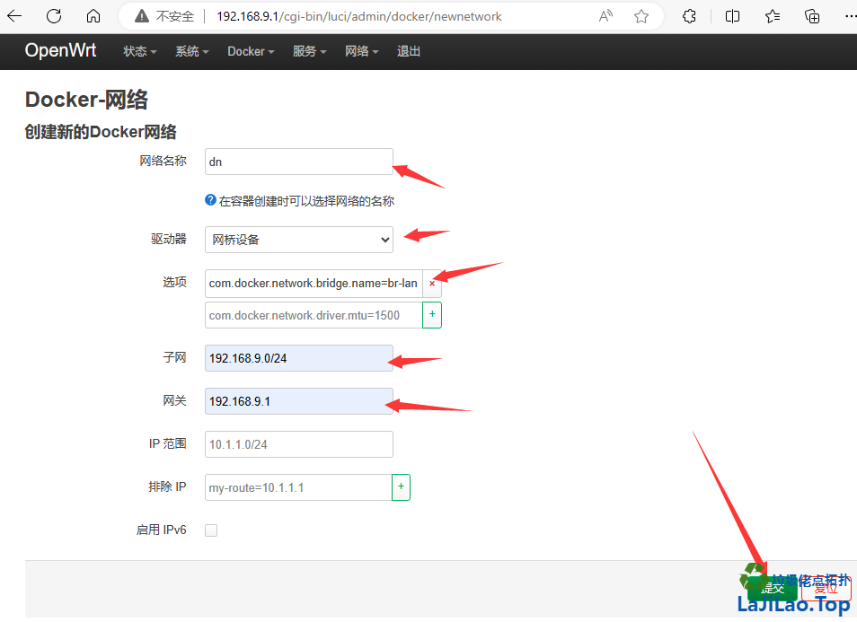

- [openwrt系统docker的容器网络加入br-lan，其实与lan同网段 - LaJiLao.Top](https://lajilao.top/thread-139-1-1.html)
  tags:: [[SendToLogseq]]
	- docker的联网方式很多，但是openwrt有有br-lan，我们为何不利用一番呢
	  命令如下：
		- [[#caption]]==`docker network create -d bridge \\`==
		- --subnet=192.168.9.0/24 --gateway=192.168.9.1 \\
		- -o "com.docker.network.bridge.name"="br-lan" dn
	- *复制代码*
	- {:height 552, :width 749} {:width 600 :height 436}
	- 网络这样创建就可以啦
	- 创建容器的时候，选dn这个网络就可以了，手动配置好192.168.9.x网段的ip就可以了
-