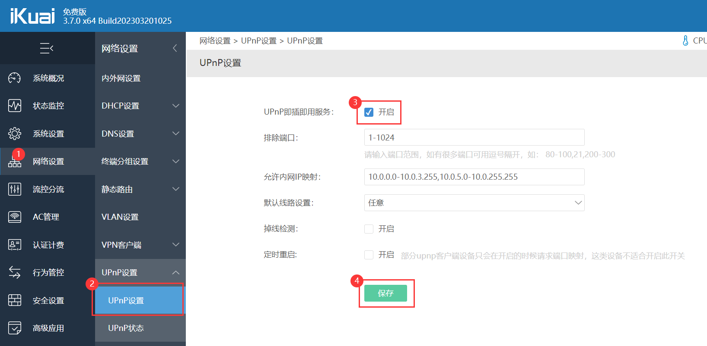
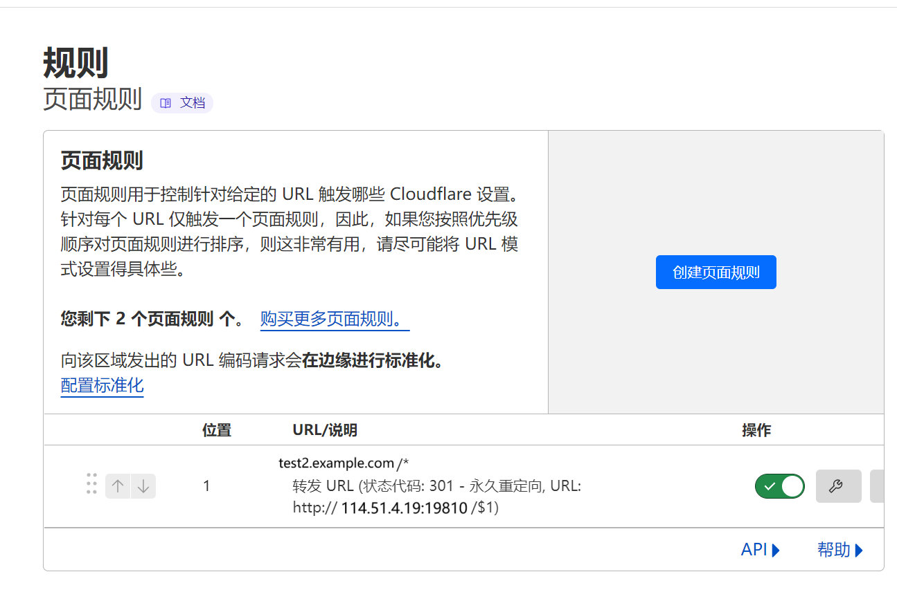

- [使用 Lucky 的 STUN 内网穿透利用 UPNP 和 NAT1 在公网打洞并配置伪 DDNS | 潇然工作室](https://www.xrgzs.top/posts/lucky-stun-upnp-nat1)
  tags:: [[SendToLogseq]]
	- 技术笔记 2024-05-17
	- ## 使用 Lucky 的 STUN 内网穿透利用 UPNP 和 NAT1 在公网打洞并配置伪 DDNS
	- ## 背景 / 需求
	- 我的要求很简单，就是在外网访问家里 NAS 服务器上的文件，实现远程办公
	- 这时候有人会说：“简单嘛，要个公网 IP 不就行了？”
	- 好好好，下面就是本人办过的宽带和要公网 IP 的经历：
	- > 电信宽带，有动态 IPv6 地址，至于公网 IPv4 地址，我要不到
	  >
	  > 联通宽带，有动态 IPv6 地址，至于动态公网 IPv4 地址，听说很容易要到，不过我没有联通宽带
	  >
	  > 移动宽带，有动态 IPv6 地址，至于 IPv4 是不是公网，懂得都懂，目前我正在用
	  >
	  > 4G、5G 网络，有 IPv6 地址，至于 IPv4 是不是公网，想都别想
	- > * 公网 IPv4 地址可以通过 NAT 网关实现网络地址转换分配给多个设备，这个网关设备通常就是路由器，通过路由器上端口映射、端口转发或 DMZ 主机等功能，即可通过 ip + 端口或域名 + 端口的形式，访问内网的设备
	  >
	  > * 公网 IPv6 地址不用解释，由于数量多，可以不用 NAT 技术来解决地址数量问题（当然也是可以 NAT 的，具体看这篇文章：《OpenWrt iStoreOS X-WRT 配置 IPv6 NAT6》），缺点就是 IPv6 目前没有做到全面覆盖（未来也不可能做到），IPv4 Only 网络下访问非常头疼，此外 IPv6 地址也是难记得要命
	  >
	  > * 现在大多数 IPv6，前端都有防火墙（如光猫防火墙），无法搭建服务，所以这种情况有 IPv6 地址都是白搭
	  >
	  > * 对于 80、443 端口，即 HTTP、HTTPS 默认服务端口，可以配置虚拟主机，实现一个端口绑定多个域名
	- 另外，咱们折腾设备的大多非网络专业，安全意识淡薄。即使您有公网 IP，鉴于国内大部分都无公网 IP，国内厂商的家用路由器基本都没有配置高级防火墙，您对外暴露的网络资产会受到攻击的风险
	- 运营商不提供给您公网 IP，实际上是给您免费添置了一台价值万元以上的防火墙，能够保护您的网络资产安全，毕竟持续的网络攻击肯定会降低您的用网质量
	- 另外，如果您有固定公网 IP，由于 IP 一直不变动，日常使用很容易出现 IP 被封的问题，使用动态 IP 能帮您省下很多麻烦，只需重启一下光猫就解决
	- 如果您拥有企业级固定公网 IP，从合规性考虑，您需要履行网络安全等级保护，这意味着您每年需要花几十万以上去做这件事。我们只是普通用户，何必这样呢？
	- ### 不同方案
	- 远程访问家用设备（NAS 等）的方法对比：https://zhuanlan.zhihu.com/p/431090794
	- 说到内网穿透，即网络打洞，实际上有很多种方案，如花生壳、frp、ngrok 等基于端口映射的方案，这些方案本人都尝试过，对于今天这篇文章，存在以下几个问题：
		- \*\*要求高，\*\*需要一台有公网 IPv4 服务器做端口转发
		- \*\*费用高昂，\*\*高带宽服务器普通用户付不起
		- \*\*配置复杂，\*\*超出普通用户的知识范围
		- \*\*速度慢，\*\*受限于公网 IPv4 服务器流量和带宽
		- \*\*延迟高，\*\*每次连接都需要经过公网 IPv4 服务器中转
	- 基于以上问题，本人一直在查找方案，经朋友推荐，了解到了一款软硬路由公网神器 ——Lucky (大吉)
	- 项目地址：
	- https://lucky666.cn/
	- https://github.com/gdy666/lucky
	- 不过这边需要注意的是，此工具新版并不开源
	- 
	- ### 使用经历
	- 不过一开始以为是 OpenWrt 路由专用，我手上又没 OpenWrt 设备，就不打算试
	- https://www.right.com.cn/forum/thread-8267181-1-1.html
	- 听说可以实现另一种形式的内网穿透，本人非常激动，然后就看了看与它相关项目 Natter，在 Windows 下用 Python 试了试没有成功，说有防火墙（实际没有）和没有权限。研究了一下文档，发现在 DDNS 的实现上还有问题，就放弃了
	- Natter：https://github.com/MikeWang000000/Natter （Python）
	  NATMap：https://github.com/heiher/natmap （不支持 Windows）
	- 后来了解到 Lucky 可以在 Docker 中运行，甚至**能直接跑在 Windows 上**，就在群晖的 Docker 上试着搭建了一下，发现正好满足了我对于内网穿透的要求
	- ### 打洞原理
	- 
	- *图源自 natter*
	- 这种 STUN（Session Traversal Utilities for NAT，NAT 会话穿越应用程序）内网穿透技术，可以帮助解决因 NAT 技术所带来的网络连接问题
	- STUN 技术允许 NAT1 用户获取公网端口，通过路由端口转发或者 LUCKY 内置转发，将内网服务端口暴露到外网，从而实现内网穿透的目的
	- 这个技术有以下几个好处：
		- 不需要一台有公网 IPv4 服务器做端口转发
		- 无需付费，最多就是购买个域名
		- 配置简单，最多浏览器 F12 抓抓包
		- 速度快，受限于你宽带的上传带宽
		- 延迟低，和你游戏联机的技术一样
	- 不过也有一些缺点：
		- 访问地址不固定，穿透后端口千变万化
		- 无法 DDNS，DNS 无法设置解析
		- 稳定性未知，保活比较难做
	- 对于前两点，可以配合 WebHook 调用相关 API，搭配 Cloudflare 的页面规则等进行 301/302 跳转，可以近似实现 DDNS 的功能
	- > **重要：**这种方案打洞之后的流量 **都被运营商看作 UDP**，可能**会被运营商 QoS**，尤其是**跨省跨运营商**，所以**有能力最好还是申请公网 IP** 。如果您的运营商有这种行为，那么您基本可以关掉这篇文章了，考虑其它的方式了
	  >
	  > 目前经过测试，部分运营商就连 TCP 协议的 FRP 都会被 DPI 识别并 QoS，因此还是建议大家拥抱 IPv6 吧
	- ## 前提条件
	- 为了能打洞成功，需要保证**您的宽带默认为 FullCone NAT（全锥型 NAT，NAT1）**，如果为您的宽带为对称性 NAT，那么不好意思，本方法不适合您
	- 此方法的原理类似 PCDN，**各大运营商都在大力打击**，将原先的 NAT1 改为 NAT4，所以无法使用此方法穿透，解决方法就是换一家运营商
	- 本文提供的方法仅供家庭用户**轻量级**使用，**不会对运营商的网络设施造成破坏性干扰**
	- ## 配置网络
	- > **推荐方案：**
	  > 光猫设置桥接模式，在路由器系统如 OpenWRT 上直接运行 LUCKY（仅经过一层 NAT）
	  >
	  > **可行方案：**
	  > 在子网中的主机上运行 LUCKY，在光猫或路由器上对其开启 DMZ 功能，或对需要开放的端口设置端口转发（手动或 UPNP）。（经过多层 NAT）
	- > **STUN 穿透环境要求**
	  >
	  > STUN 技术的实现需要一些前提条件和环境要求。在使用 STUN 穿透功能之前，需要确保路由器、光猫等网络设备的设置和网络环境都符合要求。
	  >
	  > 1. 光猫拨号的情况下你需要在光猫后台设置 DMZ 指向路由器。(路由器拨号的跳过这一步)
	  > 2. 建议使用 STUN 穿透功能的用户将 LUCKY 运行在主路由上面，如果 LUCKY 运行在局域网局域网内，以下三种设置方法任选一种
	  >    1. 你需要在路由器设置 DMZ 指向 LUCKY 所在的局域网 IP,
	  >    2. 在路由器端设置 ***穿透通道监听端口*** 指向 LUCKY 内网 IP 同样的 ***穿透通道监听端口*** , 注意前后这两个端口的数组一定要设置是同样的。
	  >    3. 开启路由器端口的 UPNP 功能。
	  > 3. 上面第二条的方法是只针对使用 Lucky 内置转发功能的设置，如果你没有使用 Lucky 内置转发，可以忽略第二条。
	- ### 光猫桥接
	- 大多数的路由器默认使用 NAT4 以保障安全，如果改为 NAT1（通常不支持），理论上可以不用开启 UPNP，NAT4 是要必须开启 UPNP 的，**所以，最好开启 UPNP**，如果没有这个功能，只能给那台设备的 IP 设置 DMZ
	- 之前我的网络是光猫桥接，爱快软路由拨号
	- 
	- 开启路由器的 UPNP 功能：
	- 
	- 如果是 OpenWrt，可以尝试打开 NAT1，或安装 UPNP 插件，不过建议直接将 Lucky 装拨号路由器上
	- ### 光猫路由
	- 然而前段时间运营商给我免费升级了 FTTR，主光猫是华为 F30，默认光猫拨号（路由），没有启用 UPNP，而且为动态超密。经过折腾，请了两转师傅都没搞到超级密码。如果您也是这种情况，又不想换猫，基本可以关掉这篇文章了。
	- 不过好在本人还是搞到了光猫的动态超级密码，由于本人目前仍在使用千兆设备，为了榨干带宽，就不折腾路由器拨号了，直接使用光猫拨号，然后打开了 UPNP 和指向我路由器的 DMZ
	- #### 打开 UPNP
	- 
	- #### 设置 DMZ
	- 
	- 最终形成以下拓扑：
	- 
	- 这样的话，OpenWrt 相当于直接连到运营商的内网，对应 IPv4 NAT 的设置，可以在 OpenWrt 上进行
	- **Lucky 也建议装到 OpenWrt 上**，这样可以直接使用 OpenWrt 的防火墙进行转发，从而使服务器能够获取到真实的 IP 地址，以及提高效率和性能
	- ### 测试打洞
	- 您需要确保您的 NAT 类型能够成功打洞，这里我们使用 HMBSbige/NatTypeTester 进行测试
	- 下载地址：https://github.com/HMBSbige/NatTypeTester/releases/latest
	- 推荐下载最小体积的那个，然后安装 .NET Desktop Runtime
	- 
	- 
	- ## 安装 Lucky
	- 官方文档：https://lucky666.cn/docs/install
	- ### OpenWrt 安装
	- 对于 OpenWrt ，这里不再重复，请看官方文档
	- 不过还是要说明一点，目前大部分固件里面直接安装的 Lucky 可能不是最新版本，这种情况可以进入旧版本 Lucky 后台，上传最新版本的安装包，以升级到最新版本。
	- ### 群晖 Docker 安装
	- **这里采用群晖 Docker 安装，注意以下配置：**
	- 使用 Host 网络：
	- 
	- 启用自动重新启动：
	- 
	- 映射存储空间位置：
	- 
	- 访问 http:// 你的 IP:16601/，用户名：666，密码：666，测试是否可用
	- ## 配置 STUN
	- 程序很强大，从端口转发到 DDNS，啥都有，建议参考官方文档进行配置
	- https://lucky666.cn/docs/modules/stun
	- 这边提供几种配置方式，建议大家都尝试一下，推荐将 Lucky 装拨号路由器上
	- ### 配置 UPNP 转发
	- 菜单 ->STUN 内网穿透 -> 穿透规则列表 -> 添加穿透规则
	- 
	- > 补充：新版已支持 UPNP，可以关掉 NAT-PMP，使用 UPNP，部分情况下兼容性更好
	- 启用规则，复制 STUN 穿透公网地址，（用手机）连接到另一个网络（如移动数据）测试
	- 
	- 如果能够访问，说明穿透成功，您可以使用 STUN 穿透公网地址**临时**访问服务
	- 我们反复开关该规则，可以看出公网地址的**端口一直在变化**
	- ### 配置路由器转发
	- 以上演示的是**普通模式**的 STUN 穿透，数据包由 Lucky 转发完成后再次交给路由器转发，路由器转发完又交给运营商 NAT 网关转发，**效率不高**
	- 可以将转发工作交给路由器，Lucky 仅负责**打洞获取穿透后的端口**，这样转发工作仅在路由器上执行，甚至能够调用硬件 offload 加速转发，小包转发性能更佳
	- 而且实测通过路由器转发，只要宽带是 NAT1、不重拨，端口没被其它用户抢占，那么每次打洞获取到的端口基本都是**固定**的，可以减少端口变动的频率
	- 下面我们以**爱快系统**为例，其它系统的路由器可以参考使用 “端口转发”、“NAT 映射”、“NAT 规则” 等功能实现
	- 首先进入网络设置 -> 端口映射，添加端口映射规则
	- 配置端口映射，将内网服务器的 IP 地址和端口映射并暴露到外网（运营商 NAT1 内网）的一个任意端口
	- > 你需要从上面那堆中看出的是：
	  >
	  > 1. Lucky 打洞服务器与内网服务器**可以不在同一台机器**
	  > 2. 数据包转发工作非 Lucky 完成，**转发性能仅由您的路由器决定**（之前转发性能还要加上 Lucky 这个因素，而且增加了数据包交换的负担）
	  > 3. 暴露的端口**并非最终在公网访问到的端口**
	  > 4. 将该端口利用 Lucky 打洞，让运营商 NAT 网关转发这个端口到最终的公网端口，从而实现**逐层内网穿透的效果**
	  > 5. 可能需要添加**放行该端口在 WAN 区域访问**的防火墙规则
	  > 6. 如果您把 Lucky 直接部署到路由器上（非 Docker），可以忽略这个过程
	- 
	- 爱快
	- 
	- OpenWRT-1
	- 
	- OpenWRT-2
	- 在 Lucky 侧我们配置穿透通道监听端口为刚才在路由器上配置的暴露到外网（运营商 NAT1 内网）的那个端口，关闭 Lucky 自带转发
	- 
	- 此时我们反复开关该规则，可以发现端口号基本不会改变
	- 经过 ITDOG 测试，外部可以正常访问
	- https://www.itdog.cn/tcping
	- 
	- ### Lucky 装拨号路由器上
	- \*\*推荐，\*\*这种情况下只需勾选 防火墙自动放行，填写内网服务器地址和端口即可，Lucky 会自动添加防火墙规则配置转发
	- > 只写着支持 iptables，不清楚是否支持 nfttables，如果无法自动添加规则的话，基于 nfttables 的新版 OpenWrt 最好安装兼容模块 `kmod-nf-ipt`
	- ### Lucky 装子路由器 / 服务器上
	- 这种情况下需要在上级路由上设置 DMZ，按照 Lucky 装拨号路由器上配置即可，亦可尝试使用上述几种方案
	- ## 配置 WebHook 伪 DDNS
	- 注意的是，此时的端口号非永久，IP 地址也非永久，注意是两个各自非永久，即使 DDNS 了 IP 也无法 DDNS 端口，需要设置 DNS 的 **URL 记录**才能实现
	- 目前没有 DDNS 程序支持设置 DNS 的 URL 记录，however，luckily，Lucky 支持 WebHook 和自定义脚本触发，有了 WebHook，我们可以调用 DNS 服务的 API 接口实现 DDNS（实际上 DDNS 程序的原理也不过如此）
	- 此处我们使用 Cloudflare 举例，实际上还可以使用其它支持跳转的 API，最主要的就是要有更新地址的接口
	- 需要注意的是，Cloudflare DNS 并不支持 URL 记录，需要使用它强大的规则来设置
	- > 我这波属实是跳进了好几个坑：
	  >
	  > * 路由器非 OpenWrt 系统
	  > * 非路由器安装
	  > * DNS 服务器不支持动态端口
	- 还有一点，我们可以使用 DDNS 解析当前公网 IP 到域名的 A 记录，然后加上端口访问，这样绑定域名是为了绑定证书支持加密访问，但操作起来比较复杂，需要同时设置 DDNS 和 WebHook URL 规则，而且假如您的公网 IP 是由多个 IP 同时轮询的，那么情况会更加复杂，所以本文仅演示通过 Lucky 穿透后的 IP 地址 + 端口来直接访问
	- > **提醒一句：此处的 “伪 DDNS” 仅适用于 HTTP 协议，如果您是 TCP / UDP 协议，请自行解决客户端问题。** 部分客户端（如 Minecraft）支持 SRV 解析，那么您只需要使用 SRV 解析就能实现真正真的 IP + 端口 DDNS。否则，您需要自行编写客户端启动脚本。
	- ### Cloudflare
	- 首先需要在 Cloudflare 托管一个任意域名
	- 打开 Cloudflare Dashboard，在域名的 DNS 设置里面添加 A 记录，ip 任意填，**打开小云朵**，**打开小云朵**，**打开小云朵**！！！
	- **请务必打开小云朵**，有些教程教的是通过 Cloudflare 中转，本文为 P2P 直连，流量不经过 CDN 中转，请悉知！！！
	- > 如果是上述将流量经过 Cloudflare 中转，我们推荐您使用 IPv6 DDNS，然后配置源站规则（Origin Rules）回源到固定端口，使用 TCP 协议，避免被运营商 QoS
	  >
	  > 如果您没有 IPv6，您也可以使用免费的 Cloudflared 实现
	  >
	  > 如果您非要使用 IPv4 打洞，也不是不行，需要分别设置 A 记录 DDNS 和源站规则（Origin Rules）回源端口动态更新
	- 
	- 如果需要使用优选，可以按照 SaaS 接入的教程来，这种网上一搜一大堆，反正就是在 SSL/TLS 自定义主机名那里添加**另一个域名**，然后配好 ACME，**回源可以任意**
	- 
	- 接下来有多种实现方式，页面规则的话免费版每个域名只能设置 3 条，而且不够动态，目前增加了重定向规则，免费版每个域名可以设置 10 条，两种方式加起来可以总共创建 3+10=13 条规则
	- **值得一提的是，所有操作均可通过 Cloudflare 的 API 自动执行**
	- 废话不多说，赶紧开搞
	- #### 重定向规则
	- 创建页面规则
	- 首先进入规则 -> 重定向规则，创建一个规则
	- 
	- 这边需要使用动态重定向
	- 如果… 当传入请求匹配时… 自定义筛选表达式
	- ```
	  1
	  ```
	- ```
	  (http.host eq "stun.example.com")
	  ```
	- 则…URL 重定向
	- 类型：动态
	- **表达式：**
	- ```
	  1
	  ```
	- ```
	  concat("http://66.66.66.66:6666", http.request.uri.path)
	  ```
	- 状态代码：301
	- 点击部署
	- 
	- 为了获取相关参数信息，我们需要重新编辑以下，模拟接口请求
	- 点击设置或编辑，重新部署，F12 抓包，从**请求地址**中获取**区域 ID**、 **规则集 ID** 和 **规则 ID**
	- 
	- ```
	  1
	  ```
	- ```
	  https://dash.cloudflare.com/api/v4/zones/{区域ID}/rulesets/{规则集ID}/rules/{规则ID}
	  ```
	- > TIP：请求参数可从刚才的那个 dash api 中获取到
	  >
	  
	- 回到 Lucky，点击编辑规则，找到 Webhook，点击开启，如下设置
	- **接口地址：**
	- ```
	  1
	  ```
	- ```
	  https://api.cloudflare.com/client/v4/zones/{区域ID}/rulesets/{规则集ID}/rules/{规则ID}
	  ```
	- 注意此处 API 地址发生了变化
	- **请求方法：**`PATCH`
	- **请求头：**
	- 使用 Global API Key（不建议）
	- ```
	  1
	  2
	  ```
	- ```
	  X-Auth-Email: 你的CF邮箱
	  X-Auth-Key: API Key
	  ```
	- 使用 API 令牌（推荐），需要开启动态重定向
	- ```
	  1
	  ```
	- ```
	  Authorization: Bearer 你的令牌
	  ```
	- > PS：上面用到的 API Key、API 令牌 均可到这个链接创建：https://dash.cloudflare.com/profile/api-tokens
	- **请求主体：**
	- ```
	  {
	  "action": "redirect",
	  "expression": "(http.host eq \"此处填写域名\")",
	  "description": "此处填写规则名称",
	  "action_parameters": {
	    "from_value": {
	      "status_code": 301,
	      "target_url": {
	        "expression": "concat(\"http://#{ipAddr}\", http.request.uri.path)"
	      },
	      "preserve_query_string": true
	    }
	  }
	  }
	  ```
	- **接口调用成功包含的字符串：**
	- ```
	  1
	  ```
	- ```
	  "success": true
	  ```
	- 
	- #### 页面规则
	- 免费版仅可创建三条规则，而且页面规则已作废，不推荐使用，请使用重定向规则替代
	- 点此乘坐电梯跳过此章节
	- 
	- 创建页面规则
	- 
	- 点击设置或编辑，保存，F12 抓包获取区域 ID 和规则 ID，https://dash.cloudflare.com/api/v4/zones/ 后面跟着那串就是，pagerules 前的是区域 ID，pagerules 后的是规则 ID
	- 
	- 
	- 回到 Lucky，点击编辑规则，找到 Webhook，点击开启，如下设置
	- **接口地址：**
	- ```
	  1
	  ```
	- ```
	  https://api.cloudflare.com/client/v4/zones/区域ID/pagerules/规则ID
	  ```
	- **请求方法：**`PUT`
	- \*\*请求头：\*\*加上鉴权参数
	- 使用 Global API Key（不建议）
	- ```
	  1
	  2
	  ```
	- ```
	  X-Auth-Email: 你的CF邮箱
	  X-Auth-Key: API Key
	  ```
	- 使用 API 令牌（推荐），需要开启页面规则
	- ```
	  1
	  ```
	- ```
	  Authorization: Bearer 你的令牌
	  ```
	- PS：上面用到的 API Key 均可到这个链接创建：https://dash.cloudflare.com/profile/api-tokens
	- **请求主体：**
	- ```
	  {
	  "targets": [
	    {
	      "target": "url",
	      "constraint": {
	        "operator": "matches",
	        "value": "你的域名/*"
	      }
	    }
	  ],
	  "actions": [
	    {
	      "id": "forwarding_url",
	      "value": {
	        "url": "http://#{ipAddr}/$1",
	        "status_code": 301
	      }
	    }
	  ],
	  "priority": 1,
	  "status": "active"
	  }
	  ```
	- **接口调用成功包含的字符串：**
	- ```
	  1
	  ```
	- ```
	  "success": true
	  ```
	- 
	- 点击 Webhook 手动触发测试按钮，如无异常，应该出现 `"success":true`
	- 然后回到 Cloudflare，可以发现配置被修改，已经不是刚才的值，说明伪 DDNS 配置成功
	- 
	- ### 自定义脚本触发
	- 另外还可以使用自定义脚本触发，配合其他程序（如 curl、docker），实现更复杂的功能
	- 
	- ### 为什么说它是 “伪 DDNS”？
	- 目前我们做到了访问域名就跳转到 IP + 端口的地址，就是 301/302 跳转，并且我们的方案支持保留链接的参数。你也可以使用一台专门的服务器来实现这个操作，但成本过于高昂而且没有现成 API，这里直接白嫖免费的 Cloudflare
	- 但由于存在 301/302 跳转后，浏览器的地址栏内就只有 IP 地址，没有域名，不是很方便
	- 具体就是如果需要分享一个已经打开的链接，需要重新编辑，把原来 IP + 端口的部分替换为域名
	- 如 http:///test2.example.com，打开后就变成 http://66.666.66.66:16666 ，如果你进入了其它目录，如：http://66.666.66.66:16666/Cloud ，你需要分享该链接，就需要改回 http://test2.example.com/Cloud
	- **提醒一句：此处的 “伪 DDNS” 仅适用于 HTTP 协议，如果您是 TCP / UDP 协议，请自行解决客户端问题。** 部分客户端（如 Minecraft）支持 SRV 解析，那么您只需要使用 SRV 解析就能实现真正真的 IP + 端口 DDNS。否则，您需要自行编写客户端启动脚本。
	- ## 最佳实践
	- https://www.daji.it:66/docs/shareteach/
	- ### 如何使用证书安全访问？
	- 由于为 IP 申请证书过于复杂，我们推荐使用域名然后申请证书安全访问
	- 您需要准备两个域名，并参考以下参数进行配置：
		- 用于跳转：example.com
		  logseq.order-list-type:: number
		  * 在 Cloudflare 那里添加重定向规则的时候，跳转到 域名 + 端口
		  ```
		  {
		    "action": "redirect",
		    "expression": "(http.host eq \"此处填写域名\")",
		    "description": "此处填写规则名称",
		    "action_parameters": {
		      "from_value": {
		        "status_code": 301,
		        "target_url": {
		          "expression": "concat(\"https://stun.example.com:#{port}\", http.request.uri.path)"
		        },
		        "preserve_query_string": true
		      }
		    }
		  }
		  ```
		- 用于解析：stun.example.com
		  logseq.order-list-type:: number
		  * 配置一个 DDNS，将您的 IPv4 公共地址使用接口获取到，然后解析到该域名
		  
		   
		  * 获取证书，这边 Lucky 可以申请
		  
		   
		  
		  
		  * 将此证书下载并部署到您的服务端上，如果您的服务端不支持证书，您可以使用 Nginx 等专业工具或 Lucky 的反向代理功能将其套用证书
		  
		  
	- 此时通过 http /https 访问 example.com 会跳转到 https 的 stun.example.com: 端口，并且浏览器不会提示证书错误
	- ### 如何实现双栈访问？
	- 您也可以设置 IPv6 DDNS，然后让使用 IPv6 访问的 example.com 跳转到 IPv6 的地址 ipv6.example.com，IPv4 访问的 example.com 跳转到 IPv4 的地址 ipv4.example.com，减少 UDP 流量
	- 
	- 需要注意最终的规则 IPv6 的那条应该再 IPv4 的上面，以下截图未加端口号，一般 IPv6 有公网，端口号固定，IPv4 需要配置 STUN 规则中的 Webhook 更新 IP 地址和 端口
	- 如果您的入口跳转域名使用了优选，需要包含 IPv6 地址，否则只会跳转到 IPv4
	- 
	- 
	- ### Lucky+DSM 实现文件点对点分享
	- 感谢网友 @Rowan 无意发现这个方法，受邀在该文章上写出来，分享给大家
	- 在群辉默认分享的时候，可以设置一下固定地址，可以免去修改地址的繁琐
	- 控制面板 > 外部访问，填写固定域名，端口默认 80，在文件分享时会默认从这个域名的 80 端口分享，也就是分享的时候不再是 ip + 端口，避免 ip 和端口跳动
	- 
	- 这样直接访问分享出来的链接就可以跳转到 NAS 的 IP 地址 + 端口了，而且无需手动修改
	- 
	- 这样可以避免使用内网穿透，无需 QC，直接连接公网 IP + 端口下载文件，且容易分享
	- > 不建议将 DSM 直接暴露在公网上，在对外公开 DSM 前，最好给 DSM 套上 WAF（Web 应用防火墙），避免脚本小子和 0day 漏洞带来数据安全问题
	- ### Lucky + 本地 Alist + 云端 Alist 实现隐藏端口号固定地址访问
	- 
	- 使用 `IP+端口`或`域名+端口`访问肯定不是一件长久的事，尤其是 Alist 文件分享。为了解决这个问题，我们可以使用 Lucky 的 STUN 穿透功能，调用 Alist 的相关 API 来实现：
		- 搭建一台本地服务器、一台云服务器
		  logseq.order-list-type:: number
		- 在本地、云服务器上安装好 Alist
		  logseq.order-list-type:: number
		- 在**本地服务器**上，使用 Lucky，把本地 Alist 的 `5244` 端口穿透出去，可以得到一个**动态**的 IP + 端口，在浏览器访问该 IP + 端口，可以正常看到本地搭建的 Alist
		  logseq.order-list-type:: number
		- 进入**云服务器**的 Alist 管理，添加一个 `Alist V3` 类型的储存，填入服务器链接为该 IP + 端口，保存后，可以在云服务器的 Alist 上看到挂载的本地 Alist
		  logseq.order-list-type:: number
		  * 您最好在这一步把需要的配置项填写好，避免后面改请求主体麻烦
		- 利用浏览器 F12=> 网络，抓取 Alist 更新配置的 API 调用信息，方法是：
		  logseq.order-list-type:: number
		  1. 进入云服务器 Alist 管理 => 存储
		  2. `F12` 打开开发人员工具，点击上方的`网络`一栏
		  3. 在 Alist 管理存储页面中，点击`编辑`刚才添加的储存后`保存`，此时浏览器会提交一个 `POST` 请求，F12 中可以看到，通常名为 `update`
		  4. 把请求地址、请求头（只需留意 `Authorization`）、请求主体复制下来，拷贝到 Lucky 的 WebHook 中对应的设置里面
		   * 请求地址如：`https://云服务器地址/api/admin/storage/update`
		   * 根据官方接口文档，**请求头只需含有 `Authorization: 你的token` 一行就行**，
		     * `Authorization` 可以是 `alist-token`，没有时间限制，可以在 Alist 管理 => 设置 => 其他 => 令牌中获取
		     * `Authorization` 也可以是用户登录生成的`临时JWT密钥`，但会有时间限制，需要修改云服务器 Alist 配置文件 `config.json` 的 `token_expires_in` 一项，延长过期时间（数值的单位是小时）
		  5. 替换请求 Body 中相关地址为`#{ipAddr}`
		   * 挂载路径、序号等设置项已经在默认的请求主体中了，如果不需要，请自行精简
		- 测试 WebHook，点击 `Webhook手动触发测试` ，此时云服务器 Alist 储存配置中服务器链接会被修改成 `http://192.168.31.1:xxxxx`
		  logseq.order-list-type:: number
		- 复制请求成功后服务器给出的回应内容到`接口调用成功包含的字符串`里面，如：
		  logseq.order-list-type:: number
		  ```
		  1
		  ```
		  ```
		  {"code":200,"message":"success","data":null}
		  ```
		- 保存后，如果没有问题，会显示 WebHook 触发结果为 “成功”
		  logseq.order-list-type:: number
		  * 如果云服务器已经能够正常连接，但 Lucky 一直显示从未触发 WebHook，或者失败，说明回应内容有问题
		  * 请按照实际情况修改`接口调用成功包含的字符串`
		  
		  * 如果云服务器的地址包含端口，使用 http 协议可能会出错
		- 返回云服务器的 Alist，查看挂载的配置是否正常更新
		  logseq.order-list-type:: number
		- 之后即可使用云服务器的 Alist 地址访问到本地的 Alist，实现网盘直链私有化，理论上下载速度就为你宽带的上传速度
		  logseq.order-list-type:: number
	- > 注意：
	  >
	  > * 如果没有云服务器，但有内网穿透，又不想走穿透流量，可以将上面的云服务器的 IP 地址改为本机（`127.0.0.1`），并使用本机 Alist 的 token，即让本地 Alist 自己给自己 WebHook 公网 IP，这样可以少使用一个 Alist 程序，本地调用 WebHook 更加安全稳定
	  > * 如果没有云服务器，但有 IPv6 地址，可以使用支持 IPv6 回源的 CDN，将 IPv6 转换为 IPv4
	  > * 为了防止 IP 被扫，运营商可能会禁 ICMP PING，海外用户的连通性需要使用其他方式测试
	  > * 对于手头上有大量没有公网 IP 地址但网络类型为 NAT1 宽带的用户来说，可以先将文件同步到各个本地服务器节点，然后把这些本地服务器挂载到云服务器 Alist，再配合上云服务器 Alist 的别名驱动和负载均衡功能，这样，客户端使用 Aria2c（IDM 不行），多次向云服务器请求下载地址，即可实现从各个本地服务器节点同时下载一个文件，提高下载速度
	- 如果懒得折腾，可以使用成品的 PCDN 储存服务，<del>如大家都知道的 123 网盘，就是使用这个原理，降低了运营成本，才带来了继蓝奏云之后大文件免登录分享的体验</del>（割韭菜）
	- ### Lucky+Cloudreve 实现自建 PCDN 网盘
	- 给个思路，服务端利用云服务器内网穿透出来，下载文件 / 中转通过 PCDN 线路，可利用 Cloudreve 自带的 CDN 功能实现
	-  {:height 404, :width 749}
	- ### Lucky+RustDesk 实现自建远程桌面服务器
	- 网上有教程，本人也尝试复现成功，一定程度上可以减轻云服务器的负担，但不方便更新地址，个人推荐搭配 Lucky 自定义脚本触发食用
	- 打通大内网番外篇 无需公网，搭建 RustDesk 远程桌面 （基于 Lucky 的 STUN 穿透） 作者：qaz741wsd856
	- ### Lucky 实现 BT 客户端绿灯
	- 网上有太多教程了，个人暂无此需求，就不写了，网友们的思路打得非常开
	- 打通大内网第二期 让 BT 下载畅通无阻 （基于 Lucky 的 STUN 穿透） 作者：qaz741wsd856
	- OpenWrt 下针对 BT 的全自动 STUN 内网穿透（Lucky 版图文教程） 作者：泥浆
	- 「LUCKY STUN 穿透」在 Windows 上使用 UPnP 工具为 BT 客户端自动添加内外端口号不同的映射规则 作者: ie-12
	- 「LUCKY STUN 穿透」使用 Webhook 自动修改 qbittorrent 的监听端口 作者: ie-12
	- 「LUCKY STUN 穿透」在 Windows 下使用 STUN 穿透实现 Minecraft 联机并设置 SRV 记录 作者: ie-12
	- 「LUCKY STUN 穿透」在 Docker 中使用 MiniUPnP 为 BT 客户端自动添加内外端口不同的映射规则 作者: ie-12
	- 「LUCKY STUN 穿透」使用 cURL 自动修改 Transmission 的监听端口 作者: ie-12
	- 「LUCKY STUN 穿透」使用 UptimeRobot 使 UPnP 映射的 TCP 规则保持活跃 作者: ie-12
	- 基于 stun 穿透工具 LUCKY，使 BT 客户端绿灯、开放 TCP 端口的办法（进化版） 作者: thegodofoxeris
	- ***
	- 您自己购买的家用宽带，就应该为您自己服务，而不是帮助其他企业薅运营商的羊毛，最后得到的收益又去向其他企业。所以赶紧动手用起来吧！
	- ***
	- 参考：
	- https://lucky666.cn/
	- https://www.bilibili.com/read/cv36096987/
	- https://b.w45sen.top/share/aNk0pAYJJFND
-