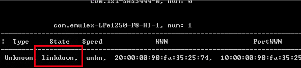
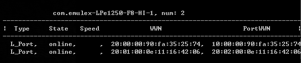

### 光纤网卡
	- #### 以太网卡
		- Ethernet Adapter,传输协议为IP协议
			- 光口
				- 接口分为SC、ST、LC
					- SFP(传输率2Gb/s)
					- GBIC(1Gb/s)
			- 电口
				- 接口类型RJ45
	- #### FC网卡
		- Fibre Channel HBA。传输协议为光纤通道协议
	- #### iSCSI网卡
		- ISCSI HBA，传输ISCSI协议，接口类型与以太网卡相同
	- #### HBA卡
		- FC-HBA卡（俗称：光纤网卡）、iSCSI-HBA卡（RJ45接口）
			- 早期的SAN存储系统中，服务器与交换机的数据传输是通过光纤进行的，因为服务器是把SCSI指令传输到存储设备上，不能走普通LAN网的IP协议，所以需要使用FC传输，因此，这种SAN就叫做FC－SAN。后来，出现了用IP协议封装的SAN，可通过LAN网络，因此，被称为IP-SAN。其中，最典型的就是现在热门的ISCSI
			- 这两种方式都需要对数据块进行频繁的读包解包操作，所以高性能的SAN系统是需要在服务器上安装一块专门负责解包工作，来减轻处理器来自网卡的负担，这种网卡称为HBA卡。HBA卡除了执行解包工作外，当然还可以提供一个光纤接口（如果是ISCSI HBA卡就是提供普通的RJ45接口）用来跟对应的交换机连接；另外，HBA物理上可以把它当作网卡一样插，PCI或者PCI-E槽位里，因此，这种设备的用法非常像一张网卡，很多人也就把他跟普通网卡或者普通的光纤网卡混淆。当然，有的ISCSI HBA卡就可以当作普通网卡来用，不过从价格上考虑这样非常浪费的
			- HBA的常规定义：它是连接主机I/O总线和计算机内存系统的I/O适配器。
				- 根据定义：
					- 显卡是连接视频总线和内存
					- 网卡是连接网络总线和内存
				- SCSI－FC卡   是连接SCSI或者FC总线和内存，它们都应该是HBA
				- HBA卡              是FC－ISCSI HBA将来还有其他的HBA卡
					- HBA通常是在SCSI。Adapter和NIC用于FC；而NIC也会用于以太网和令牌环网。其实，网卡是大家常提到的一个类型设备的总称，是指安装在主机里，通过网络连接线与网络交换机（以太网交换机、FC交换机、ISCSI交换机等），或是其他网络设备（存储设备、服务器、工作站等）连接，从而形成一个网络的硬件设备。说了这么多HBA的东西，那么，到底光纤网卡是不是指光纤口HBA卡呢？
					- Windows查看HBA卡信息
						- 下载fcinfo工具
							- http://www.microsoft.com/download/en/details.aspx?displaylang=en&id=17530
							- 
							- 
								- WWN: world wide number 是硬件的全球唯一标示
								- WWPN: world wide port number 是指端口号
								- WWNN: world wide node number 是指节点号
									- 如果是光纤交换机的话wwn和wwnn是一样的,而wwpn是指每个光纤端口.
									- 如果是HBA卡的话,若是只有一个端口则三者可能一样,若是有多个端口则和交换机差不多
									- WWN是HBA卡用的是编号，每一个光纤通道设备都有一个唯一的标识，称为WWN（world wide name），由IEEE负责分配。
									- 在有多台主机使用磁盘阵列时，通过WWN号来确定哪台主机正在使用指定的LUN（或者说是逻辑驱动器），被使用的LUN其他主机将无法使用
									- 一台SAN交换机，不可拆分，有一个WWNN，它有一堆端口，每个端口有一个WWPN。
									- 一块多口光纤HBA，卡本身有一个WWNN，每个端口有一个WWPN
									- 单口的HBA也是，不过只有一个WWNN和一个WWPN
-
-
- [[博科Bradcom FC300光纤交换机详细配置教程]]