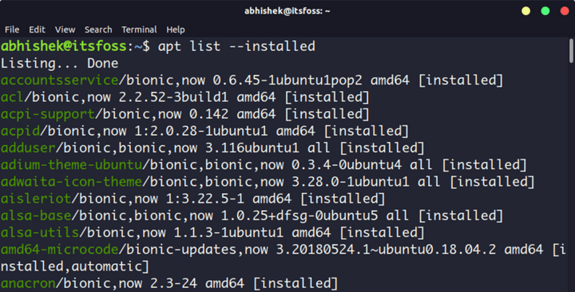
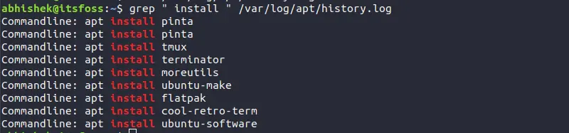
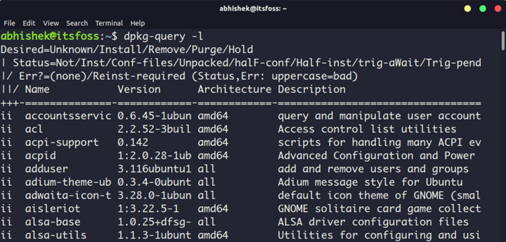
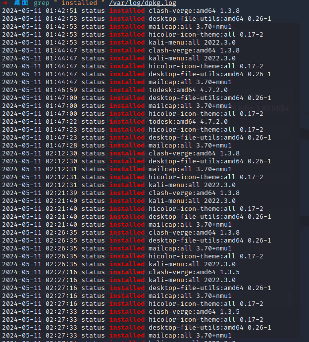

- 所有基于Debian分支理论上都支持，Debian使用apt及dpkg进行软件包管理
- APT
	- ```
	  #列出通过apt命令安装的软件包
	  apt list --installed
	  ```
		- 
		- ```
		  #可以加 grep 过滤软件名
		  apt list --installed | grep program_name
		  ```
	- ```
	  #查看 apt 历史命令。但不会显示被依赖安装的软件包
	  grep " install " /var/log/apt/history.log
	  ```
		- 
- DPKG
	- 其实 apt 与 apt-get 命令都是基于 dpkg
	- ```
	  dpkg-query -l
	  ```
		- 
		- ```
		  #同样也可以通过 dpkg 命令的历史日志，会显示所有的软件安装包，其中包括最近安装的过程中所依赖的软件包。
		  grep " install " /var/log/dpkg.log
		  ```
			- 