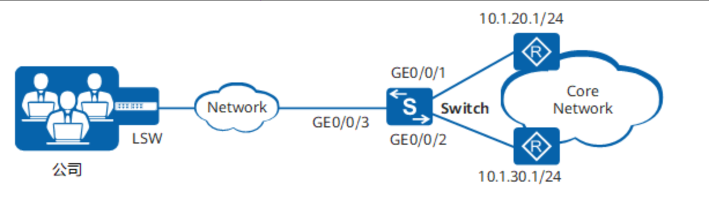

- 
- ## 配置ACL
	- 在Switch上创建编码为3001、3002的高级ACL，规则分别为允许源IP地址为192.168.100.0/24和192.168.101.0/24的报文通过
	  collapsed:: true
		- ```clojure
		  [Switch] acl 3001
		  [Switch-acl-adv-3001] rule permit ip source 192.168.100.0 0.0.0.255
		  [Switch-acl-adv-3001] quit
		  [Switch] acl 3002
		  [Switch-acl-adv-3002] rule permit ip source 192.168.101.0 0.0.0.255
		  [Switch-acl-adv-3002] quit
		  ```
- ## 配置流分类 ~~traffic classifier~~
	- 在Switch上创建流分类c1、c2，匹配规则分别为ACL 3001和ACL 3002。
	  collapsed:: true
		- ```clojure
		  [Switch] traffic classifier c1 operator or
		  [Switch-classifier-c1] if-match acl 3001
		  [Switch-classifier-c1] quit
		  [Switch] traffic classifier c2 operator or
		  [Switch-classifier-c2] if-match acl 3002
		  [Switch-classifier-c2] quit
		  ```
- ## 配置流行为 ~~traffic behavior~~
	- 在Switch上创建流行为b1、b2，并分别指定重定向到10.1.20.1/24和10.1.30.1/24的动作。
	  collapsed:: true
		- ```clojure
		  [Switch] traffic behavior b1
		  [Switch-behavior-b1] redirect ip-nexthop 10.1.20.1
		  [Switch-behavior-b1] quit
		  [Switch] traffic behavior b2
		  [Switch-behavior-b2] redirect ip-nexthop 10.1.30.1
		  [Switch-behavior-b2] quit
		  ```
- ## 配置流策略 ~~traffic policy~~
	- 在Switch上创建流策略p1，将流分类和对应的流行为进行绑定。
	  collapsed:: true
		- ```clojure
		  [Switch] traffic policy p1
		  [Switch-trafficpolicy-p1] classifier c1 behavior b1
		  [Switch-trafficpolicy-p1] classifier c2 behavior b2
		  [Switch-trafficpolicy-p1] quit
		  ```
- ## 应用流策略
	- 将流策略p1应用到接口GE0/0/3的入方向上。
	  collapsed:: true
		- ```clojure
		  [Switch] interface gigabitethernet 0/0/3
		  [Switch-GigabitEthernet0/0/3] traffic-policy p1 inbound
		  [Switch-GigabitEthernet0/0/3] return
		  ```
- ## 检查
	- 查看ACL规则的配置信息。
	  collapsed:: true
		- ```clojure
		  <Switch> display acl 3001
		  Advanced ACL 3001, 1 rule
		  Acl's step is 5
		   rule 5 permit ip source 192.168.100.0 0.0.0.255
		  <Switch> display acl 3002
		  Advanced ACL 3002, 1 rule
		  Acl's step is 5
		   rule 5 permit ip source 192.168.101.0 0.0.0.255
		  ```
	- 查看流分类的配置信息。
	  collapsed:: true
		- ```clojure
		  <Switch> display traffic classifier user-defined
		    User Defined Classifier Information:
		      Classifier: c2
		       Operator: OR
		       Rule(s) :if-match acl 3002
		          
		      Classifier: c1
		        Operator: OR
		        Rule(s) : if-match acl 3001
		  
		  Total classifier number is 2   
		  ```
	- 查看流策略的配置信息。
	  collapsed:: true
		- ```clojure
		  <Switch> display traffic policy user-defined p1
		    User Defined Traffic Policy Information:
		    Policy: p1
		     Classifier: c1
		      Operator: OR
		       Behavior: b1
		        Redirect: no forced
		          Redirect ip-nexthop
		          10.1.20.1
		     Classifier: c2
		      Operator: OR
		       Behavior: b2
		        Redirect: no forced
		          Redirect ip-nexthop
		          10.1.30.1
		  ```