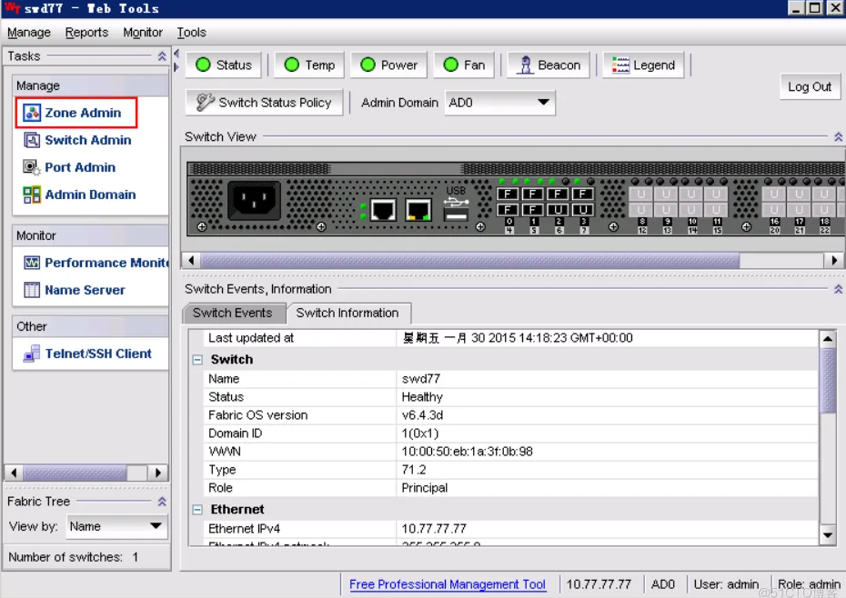

- *光纤交换机作为SAN网络的重要组成部分，在日常应用中非常普遍，本次将以常用的博科交换机介绍基本的配置方法*
- 博科300实物图：
  
- ## 一、环境描述：
	- 
- *四台服务器通过各自的双HBA卡连接至两台博科300光纤交换机，IBM V3700为双控制器，每个控制器再分别与两台光纤交换机相连。*
- 完成所有的连线及配置工作后，还需对光纤交换机作相应配置，当然不配置当傻瓜机也能使用，但一般还是需要配置，创建别名、划分ZONE等，这里只介绍一台光纤交换机的配置过程，另一台配置方法相同
- 交换机接口详细连接信息如下：
	- 
- 准备创建的别名信息如下：
	- 
- 准备划分的ZONE信息如下：
	- 
- ## 二、配置步骤
	- 开始配置光纤交换机，可以从图形界面(JAVA)或者命令行两种方式配置，首先介绍图形化配置方式，在浏览器中输入10.77.77.77进入登陆界面，输入默认登陆信息admin/password，进入管理系统。
		- 
	- 管理系统界面：
		- 
	- 点击上图红框中的Zone Admin进入ZONE配置界面，如下图，配置顺序为首先创建Alias（别名）、再创建Zone（区域）、最后配置Zone Config（保存配置）：
		- 
	- 按照上面规划好的别名开始创建，点击上图中的New Alias，如下图，输入名称，点击OK
		- .
	- 如下图，Name中选择好刚创建的别名，然后在Member Selection List中选择存储V3700实际接的端口，这里为1,0，选中1,0，再点击中间的“Add Member >>”，完成端口的添加。这样一个别名就创建好了，其它5个别名也按此方法创建
		- 
	- 接着开始创建Zone，如下图，选择中间的Zone选项栏，如下图，点击New Zone，输入ZONE name，点OK
		- 
	- Name选中刚才创建的Zone，Member selection List中选择Aliases，选择该区域的两个端口，即esxi01_hba01和ibmv3700_spa01，选中点击Add Members添加至zone中，其它7个zone也同样方法添加。
		- 
	- 完成8个ZONE创建后如下图所示；
	  接着点Zone Config开始保存配置，输入Config name名称，如下图
		- 
	- 如下图，在Member Selection List中，全选刚才建的8个Zone，点击Add Member，添加至右边窗口中，再点击下图中的Enable Config按扭来生效配置；
		- 
	- 选择刚才创建的配置文件newconfig，点击OK，完成后，再点右边的Save Config来保存配置信息。
		- 
- 通过命令配置：（可选，建议用WEB配置）
	- ### 1.alias创建：
		- 第一台交换机：
			- ```
			  alicreate “ibm_v7000_spa01”,“1,0”
			  alicreate “ibm_v7000_spb01”,“1,1”
			  alicreate “esxi01_hba01”,“1,2”
			  alicreate “esix_02_hba01”,“1,3”
			  alicreate “yingyongserver01_hba01”,“1,4”
			  alicreate “yingyongserver02_hba01”,“1,5”
			  ```
		- 第二台交换机：
			- ```
			  alicreate “ibm_v7000_spa02”,“1,0”
			  alicreate “ibm_v7000_spb02”,“1,1”
			  alicreate “esix_01_hba02”,“1,2”
			  alicreate “esix_02_hba02”,“1,3”
			  alicreate “yingyongserver01_hba02”,“1,4”
			  alicreate “yingyongserver02_hba02”,“1,5”
			  ```
	- ### 2.zone创建：
		- 第一台：
			- ```
			  zonecreate “esix_01_ibmv7000_spa”,“ibm_v7000_spa01;esxi01_hba01”
			  zonecreate “esix_01_ibmv7000_spb”,“ibm_v7000_spb01;esxi01_hba01”
			  zonecreate “esix_02_ibmv7000_spa”,“ibm_v7000_spa01;esix_02_hba01”
			  zonecreate “esix_02_ibmv7000_spb”,“ibm_v7000_spb01;esix_02_hba01”
			  zonecreate “yingyongserver1_ibmv7000_spa”,“ibm_v7000_spa01;yingyongserver01_hba01”
			  zonecreate “yingyongserver1_ibmv7000_spb”,“ibm_v7000_spb01;yingyongserver01_hba01”
			  zonecreate “yingyongserver2_ibmv7000_spa”,“ibm_v7000_spa01;yingyongserver02_hba01”
			  zonecreate “yingyongserver2_ibmv7000_spb”,“ibm_v7000_spb01;yingyongserver02_hba01”
			  
			  ```
		- 第二台：
			- ```
			  zonecreate “esix_01_ibmv7000_spa”,“ibm_v7000_spa02;esxi01_hba02”
			  zonecreate “esix_01_ibmv7000_spb”,“ibm_v7000_spb02;esxi01_hba02”
			  zonecreate “esix_02_ibmv7000_spa”,“ibm_v7000_spa02;esix_02_hba02”
			  zonecreate “esix_02_ibmv7000_spb”,“ibm_v7000_spb02;esix_02_hba02”
			  zonecreate “yingyongserver1_ibmv7000_spa”,“ibm_v7000_spa02;yingyongserver01_hba02”
			  zonecreate “yingyongserver1_ibmv7000_spb”,“ibm_v7000_spb02;yingyongserver01_hba02”
			  zonecreate “yingyongserver2_ibmv7000_spa”,“ibm_v7000_spa02;yingyongserver02_hba02”
			  zonecreate “yingyongserver2_ibmv7000_spb”,“ibm_v7000_spb02;yingyongserver02_hba02”
			  
			  ```
	- ### 3.cfg创建：
		- 第一台：
			- ```
			  cfgcreate “newcfg”,
			  “esix_01_ibmv7000_spa;esix_01_ibmv7000_spb;
			  esix_02_ibmv7000_spa;esix_02_ibmv7000_spb;
			  yingyongserver1_ibmv7000_spa;yingyongserver1_ibmv7000_spb;
			  yingyongserver2_ibmv7000_spa;yingyongserver2_ibmv7000_spb”
			  
			  ```
		- 第二台：
			- ```
			  cfgcreate “newcfg”,
			  “esix_01_ibmv7000_spa;esix_01_ibmv7000_spb;
			  esix_02_ibmv7000_spa;esix_02_ibmv7000_spb;
			  yingyongserver1_ibmv7000_spa;yingyongserver1_ibmv7000_spb;
			  yingyongserver2_ibmv7000_spa;yingyongserver2_ibmv7000_spb”
			  
			  ```
	- ### 4.启用配置
		- ```
		  cfgenable “newcfg”
		  cfgsave
		  ```
	- ### 最后show一下配置是否启用以及是否出错
		- ```
		  switchshow：
		  
		  swd77:admin> switchshow
		  switchName: swd77
		  switchType: 71.2
		  switchState: Online
		  switchMode: Native
		  switchRole: Principal
		  switchDomain: 1
		  switchId: fffc01
		  switchWwn: 10:00:50:eb:1a:3f:0b:98
		  zoning: ON (newconfig)
		  switchBeacon: OFF
		  
		  ```
			- Index Port Address Media Speed State Proto
				- ```
				  0 0 010000 id N8 Online FC F-Port 50:05:07:68:03:09:fb:d8
				  1 1 010100 id N8 Online FC F-Port 50:05:07:68:03:09:fb:d9
				  2 2 010200 id N8 Online FC F-Port 21:00:00:24:ff:0e:19:66
				  3 3 010300 id N8 Online FC F-Port 10:00:8c:7c:ff:65:e2:49
				  4 4 010400 id N8 Online FC F-Port 10:00:00:05:1e:fd:98:8c
				  5 5 010500 id N8 Online FC F-Port 10:00:00:05:1e:fd:97:48
				  6 6 010600 id N8 No_Light FC
				  7 7 010700 id N8 No_Light FC
				  8 8 010800 – N8 No_Module FC (No POD License) Disabled
				  9 9 010900 – N8 No_Module FC (No POD License) Disabled
				  10 10 010a00 – N8 No_Module FC (No POD License) Disabled
				  11 11 010b00 – N8 No_Module FC (No POD License) Disabled
				  12 12 010c00 – N8 No_Module FC (No POD License) Disabled
				  13 13 010d00 – N8 No_Module FC (No POD License) Disabled
				  14 14 010e00 – N8 No_Module FC (No POD License) Disabled
				  15 15 010f00 – N8 No_Module FC (No POD License) Disabled
				  16 16 011000 – N8 No_Module FC (No POD License) Disabled
				  17 17 011100 – N8 No_Module FC (No POD License) Disabled
				  18 18 011200 – N8 No_Module FC (No POD License) Disabled
				  19 19 011300 – N8 No_Module FC (No POD License) Disabled
				  20 20 011400 – N8 No_Module FC (No POD License) Disabled
				  21 21 011500 – N8 No_Module FC (No POD License) Disabled
				  22 22 011600 – N8 No_Module FC (No POD License) Disabled
				  23 23 011700 – N8 No_Module FC (No POD License) Disabled
				  
				  zoneshow：
				  
				  swd77:admin> zoneshow
				  Defined configuration:
				  cfg: newconfig
				  esxi01_v3700spa; esxi01_v3700spb; esxi02_v3700spa;
				  esxi02_v3700spb; yingyongserver1_v3700spa;
				  yingyongserver1_v3700spb; yingyongserver2_v3700spa;
				  yingyongserver2_v3700spb
				  zone: esxi01_v3700spa
				  esxi01_hba01; ibmv3700_spa01
				  zone: esxi01_v3700spb
				  esxi01_hba01; ibmv3700_spb01
				  zone: esxi02_v3700spa
				  esxi02_hba01; ibmv3700_spa01
				  zone: esxi02_v3700spb
				  esxi02_hba01; ibmv3700_spb01
				  zone: yingyongserver1_v3700spa
				  ibmv3700_spa01; yingyongserver1_hba01
				  zone: yingyongserver1_v3700spb
				  ibmv3700_spb01; yingyongserver1_hba01
				  zone: yingyongserver2_v3700spa
				  ibmv3700_spa01; yingyongserver2_hba01
				  zone: yingyongserver2_v3700spb
				  ibmv3700_spb01; yingyongserver2_hba01
				  alias: esxi01_hba01
				  
				  0; 1,2
				  alias: esxi02_hba01
				  1,3
				  alias: ibmv3700_spa01
				  1,0
				  alias: ibmv3700_spb01
				  1,1
				  alias: yingyongserver1_hba01
				  1,4
				  alias: yingyongserver2_hba01
				  1,5
				  
				  Effective configuration:
				  cfg: newconfig
				  zone: esxi01_v3700spa
				  1,2
				  1,0
				  zone: esxi01_v3700spb
				  1,2
				  1,1
				  zone: esxi02_v3700spa
				  1,3
				  1,0
				  zone: esxi02_v3700spb
				  1,3
				  1,1
				  zone: yingyongserver1_v3700spa
				  1,0
				  1,4
				  zone: yingyongserver1_v3700spb
				  1,1
				  1,4
				  zone: yingyongserver2_v3700spa
				  1,0
				  1,5
				  zone: yingyongserver2_v3700spb
				  1,1
				  1,5
				  
				  ```
				-