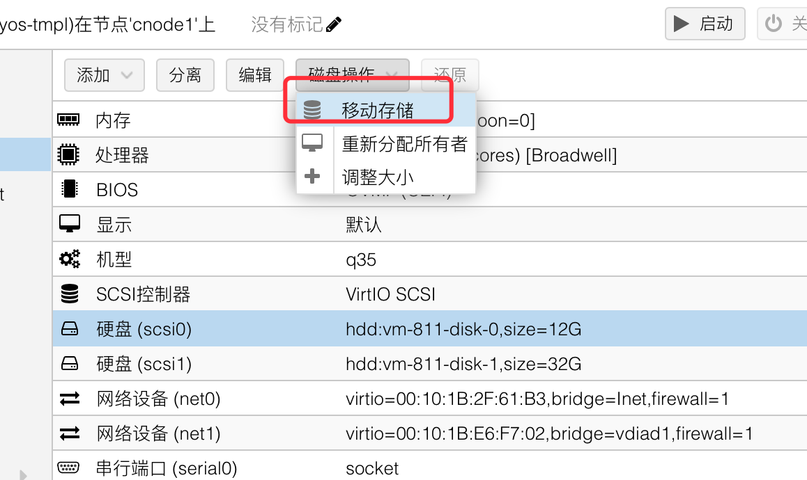

- [佛西博客 - 备份PVE的配置信息，重装后快速恢复。](https://foxi.buduanwang.vip/virtualization/pve/3022.html/)
  tags:: [[SendToLogseq]]
	- 这里简要介绍下PVE如何进行备份信息。
	- 假设我们备份的地方是U盘，U盘挂载到在/media目录。
	- ## 1. 备份虚拟机磁盘
	- 虚拟机的磁盘是最重要的。如果虚拟机在pve的系统盘上，则重装会清空系统盘。这会导致丢失数据。
	- 最理想的方式，把虚拟机放到第二块硬盘上，可以在pve上挂载第二块盘，然后通过移动磁盘功能，将虚拟机的磁盘移动到第二块盘。
	- 这个功能如下。
	-  移动磁盘之后，就不需要做其他的了，虚拟机的配置信息，可以在第二步进行备份。
	- ## 2. 备份PVE本身的信息
	- ```
	  cp -r /var/lib/pve-cluster /media
	  ```
	- PVE的存储信息，虚拟机信息，集群的设置比如标签、SDN、用户信息之类都存储在`/var/lib/pve-cluster/config.db`中。我们只需要备份这个db文件就可以，这里为了方便，就全部备份了。
	- ### 如何还原？
	- 这里我们需要注意一点，备份之前的主机名必须和重装后的主机名一致，比如你原来的主机名叫做pve，那你新装了之后也要叫pve。
	- 在新装的PVE上，挂载U盘到/media。将config.db拷贝回去。
	- ```
	  cp /media/pve-cluster/config.db /var/lib/pve-cluster
	  ```
	- 然后重启pve即可。如果你前后的主机名不一样。则会在web上看到2个节点，一个新的机器，一个老的主机，虚拟机都在老主机上。所以一定要确保重装前后主机名一致。
	- ## 3. 备份一些额外的配置
	- 备份启动配置，模块配置
	- ```
	  mkdir /media/{boot,modprobe}
	  cp /etc/modules-load.d/* /media/modprobe/
	  cp /etc/default/grub /media/boot/
	  cp /etc/modules /media/
	  
	  ```
	- 要还原的话，我们逆向一下
	- ```
	  cp /media/modprobe/*  /etc/modules-load.d/
	  cp /media/boot/grub /etc/default/
	  cp /media/modules /etc/
	  
	  ```
	- 接着我们要更新grub
	- ```
	  update-grub
	  ```
	- 还有更新内核参数
	- ```
	  update-initramfs -k all -u
	  ```
	- ##  4. 备份网络
	- 个人觉得网络没有什么好备份的，如果需要请，
	- ```
	  cp -r /etc/netowork /media/
	  ```
	- 要还原的话，需要
	- `cp -r /media/netowork/* /etc/netowork/`
	- 然后重启主机，或者重启网络`systemctl restart networking`
	- 当然新手小伙伴，增加、变换了网卡的槽位，就不要无脑还原网卡了。
-