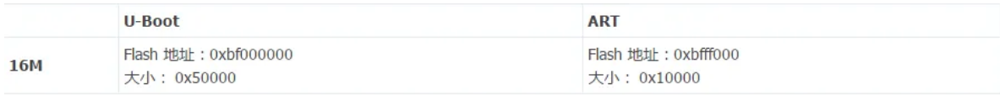
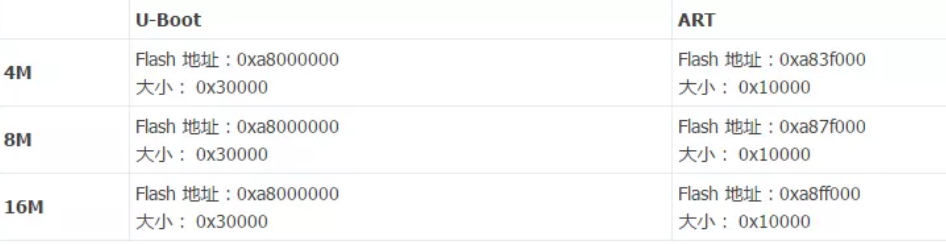
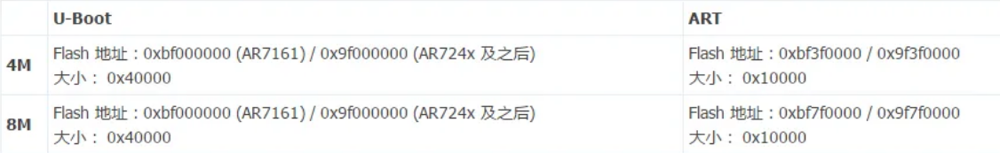

-
- TP-LINK 固件：
	- 
- 网件 WNDR3700v2/WNDR3800/WNDRMAC：
	- *仅 U-Boot 及 ART，因为原厂升级固件不能直刷*
	- 
- AR2317 UBNT：
	- *仅 U-Boot 及 board_config，因为原厂升级固件不能直刷,仅适用于不死 U-Boot(Breed)*
	- 
- AR7161 AR724x AR934x UBNT：
	- *仅 U-Boot 及 EEPROM/ART，因为原厂升级固件不能直刷*
	- 
-