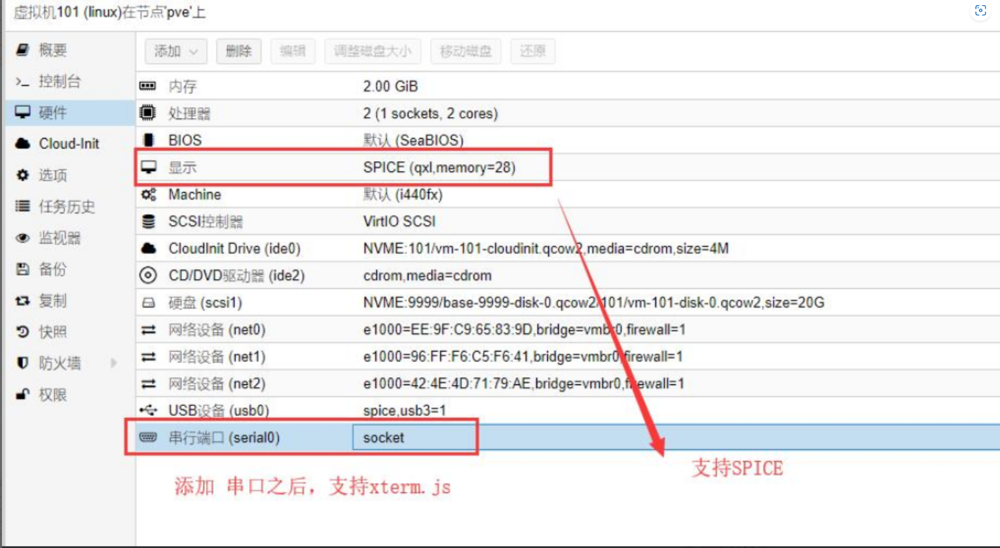
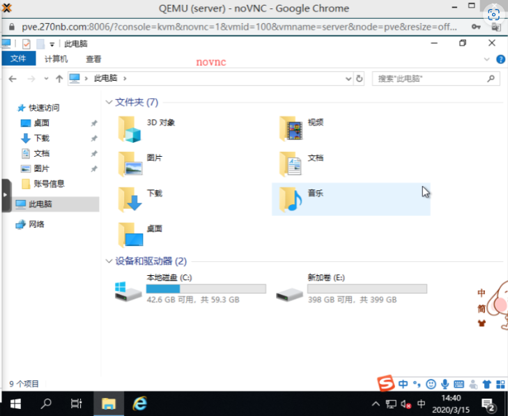
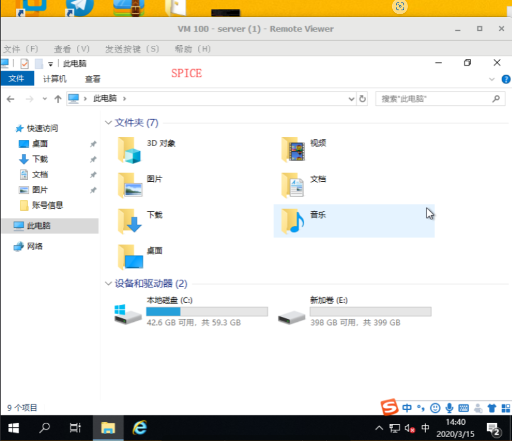

- 
- ### noVNC
	- ***web的VNC***
	- /usr/share/novnc-pve/app.js
	- 
- ### SPICE
	- ***是rehat开发的显示协议。需要的软件为virt-viewer***
	- 显示适配器设置成【SPICE】之后，支持spice控制台
	- vitl-viewer下载地址： https://www.spice-space.org/download.html
	- 
- ### xterm.js
	- 依靠串口实现 使用串口显示添加【串口】设备添加【串口】设备
	- 添加【串口】设备
		- ```cloujure
		  # 修改虚拟机的GRUB
		  echo 'GRUB_CMDLINE_LINUX="quiet console=tty0 console=ttyS0,115200"' >> /etc/default/grub
		  ```