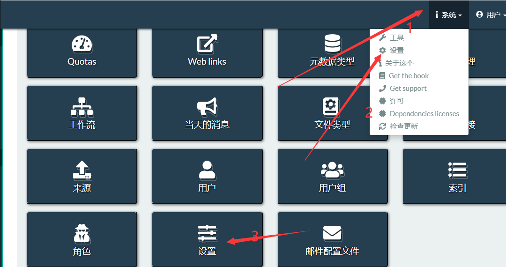
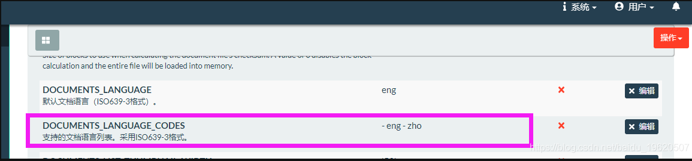
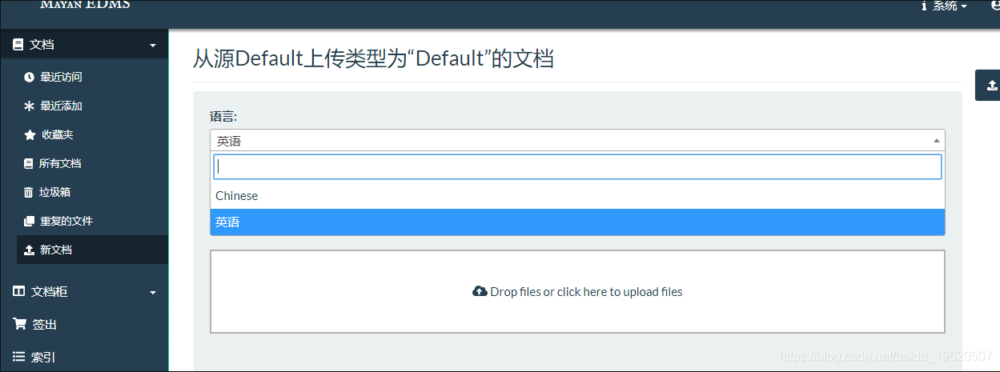

- 摘自https://blog.csdn.net/baidu_19620507/article/details/105411848
- ## 1.介绍
  安装完后报错OCR识别中文报错了
  Exception calling Tesseract with language option: zho; RAN: /usr/bin/tesseract - - -l zhoSTDOUT: STDERR: Error opening data file /usr/share/tesseract-ocr/4.00/tessdata/zho.traineddata Please make sure the TESSDATA_PREFIX environment variable is set to your “tessdata” directory. Failed loading language ‘zho’ Tesseract couldn’t load any languages! Could not initialize tesseract. The requested OCR language “zho” is not available and needs to be installed.
	- 文档管理系统 Mayan EDMS，安装完默认OCR不支持中文的。
		- 文档管理系统 Mayan EDMS默认采用Tesseract，可以自己后端封装。
			- `OCR_BACKEND的默认值为 "ocr.backends.tesseract.Tesseract"`
		- 要在使用Tesseract时为OCR更多语言添加支持，请安装相应的语言文件。如果使用基于Debian的操作系统，此命令将显示可用的语言文件：
			- `apt-cache search tesseract-ocr`
- ## 2.步骤
  Mayan EDMS使用的标准是ISO 639-3，默认显示很多很多的语言，我们删去不要的，默认支持中文和英语
	- 系统-设置-设置-文档
		- 
		- ***DOCUMENTS_LANGUAGE_CODES***
			- 例如，将列表缩小为仅英语和中文
			- `DOCUMENTS_LANGUAGE_CODES = ('eng', 'zho')`
				- zho在ISO 639表示中文，其他语言在https://tesseract-ocr.github.io/tessdoc/Data-Files查找
					- 
			- 也可以使用以下命令配置下拉菜单中显示的默认语言：
				- ```DOCUMENTS_LANGUAGE = 'zho'```
			- 修改完后重启服务
				- ```sudo systemctl restart supervisor```
			- 完成后如图
				- 
- ### 3，上传OCR训练文件库
	- ```
	  cd /usr/share/tesseract-ocr/4.00/tessdata
	  ls
	  ```
- 默认是没有zho.traineddata这个训练文件的
  下载traineddata地址
  找到
  chi_sim Chinese - Simplified chi_sim.traineddata
  chi_tra Chinese - Traditional chi_tra.traineddata
- https://tesseract-ocr.github.io/tessdoc/Data-Files
  1
  这里我们下载chi_sim.traineddata简体中文就好了
- https://github.com/tesseract-ocr/tessdata/raw/4.00/chi_sim.traineddata
  1
  下载完成后，上传到
- /usr/share/tesseract-ocr/4.00/tessdata
  1
  修改为zho.traineddata
- 现在这个系统就可以支持中文的图片识别了
  ————————————————
  版权声明：本文为CSDN博主「lefooter」的原创文章，遵循CC 4.0 BY-SA版权协议，转载请附上原文出处链接及本声明。
  原文链接：https://blog.csdn.net/baidu_19620507/article/details/105411848