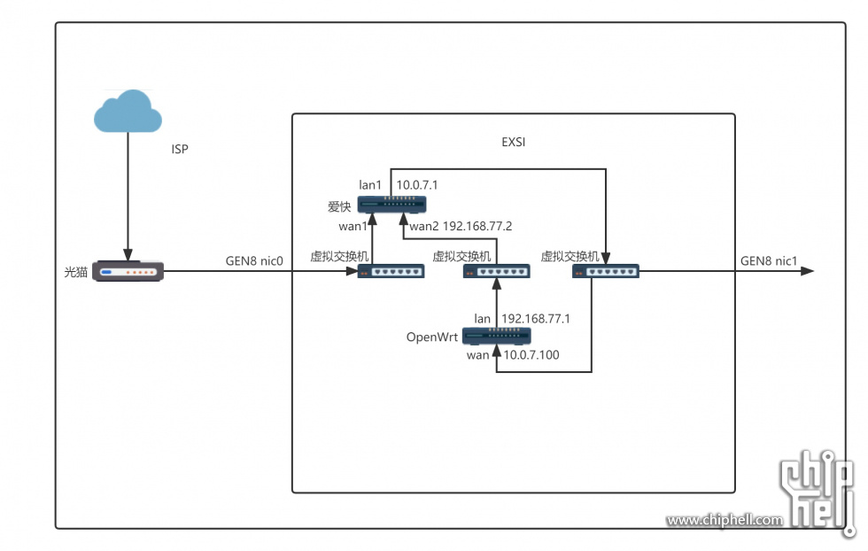
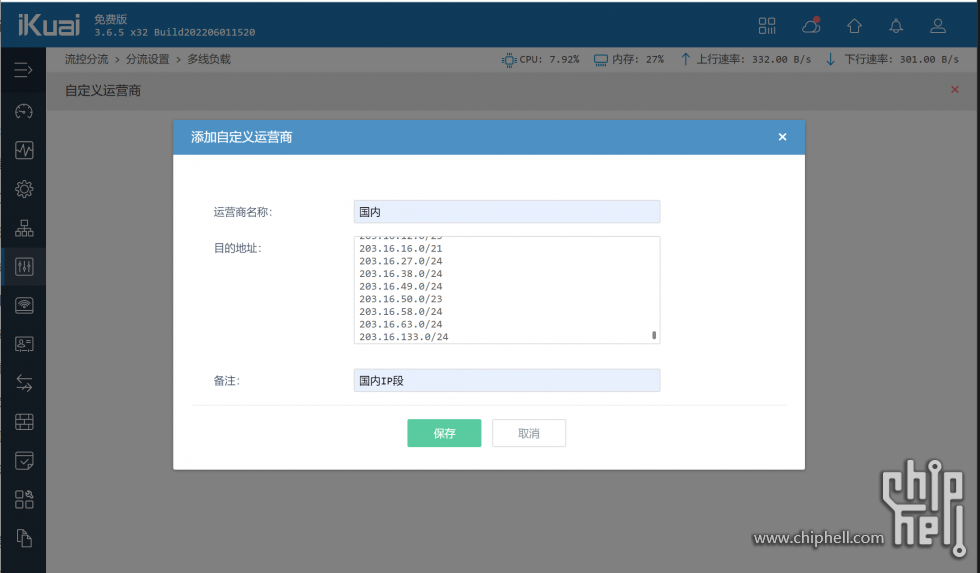
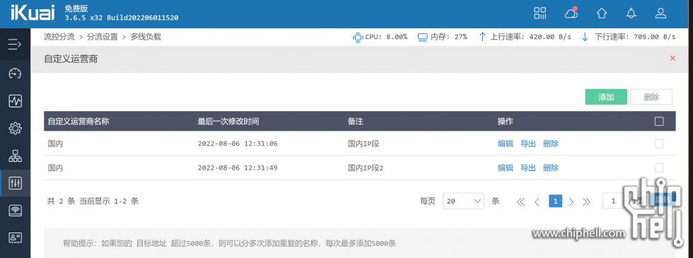
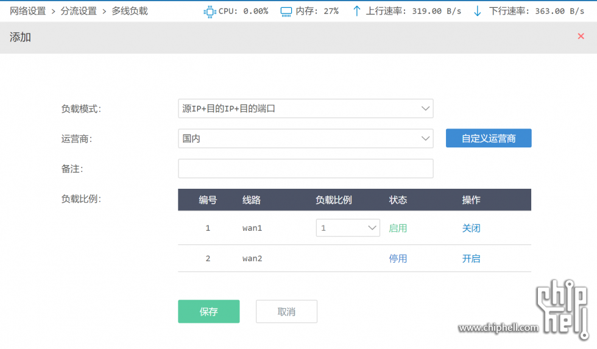
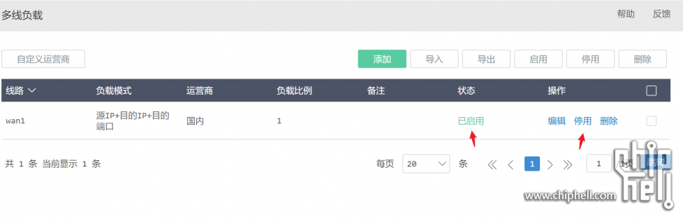
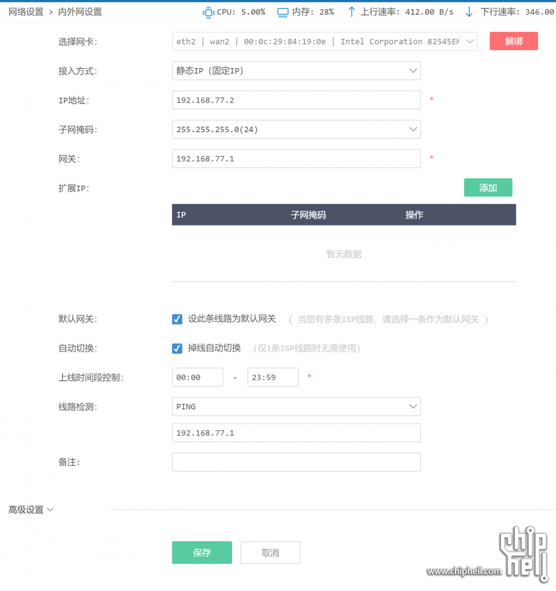
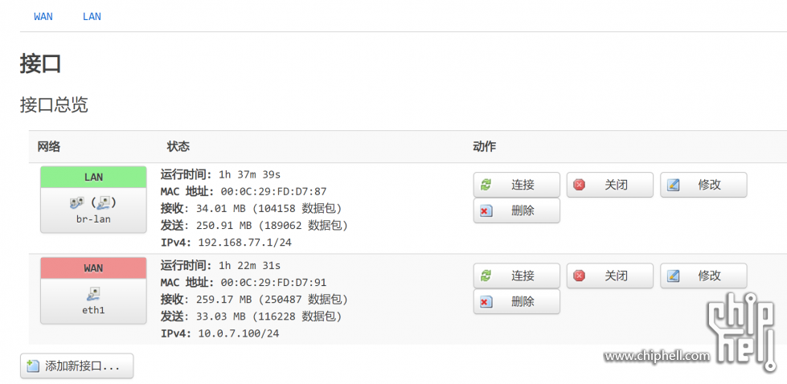
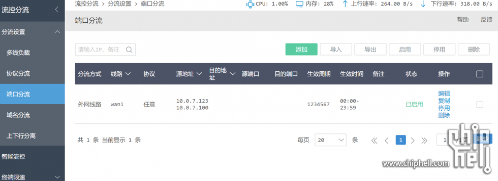

- [爱快 & OpenWrt 分流网络拓扑 - 电脑讨论(新) - Chiphell - 分享与交流用户体验](https://www.chiphell.com/forum.php?mod=viewthread&tid=2441184&extra=page%3D1&ordertype=1&page=1)
  tags:: [[SendToLogseq]]
	- *本帖最后由 eezz 于 2022-9-6 15:30 编辑*
	- **此架构用于淘汰常见的双路由使用OpenWrt做旁路由的用法。单路由爱好者请跳过此文。**
	  此拓扑优势：
	  可以接受 OpenWrt 死机/故障。
	  爱快分流。
	  爱快下内网设备同一个网络内，没有跨三层问题。
	  可以在爱快上设置某个或者某些设备走 OpenWrt 出站。
	  .内网流量仅经过一个网关，没有网关损耗问题。
	- 本文约定：
	  1.用ESXi
	  2.要有爱快，OpenWrt。
	  10.0.7.1/24做内网，各位具体实施的时候根据自家网络情况修改。
	  3.内网设备 IP
	  爱快 lan1 地址 10.0.7.1
	  OpenWrt WAN 10.0.7.100
	  OpenWrt LAN 192.168.77.1
	- 拓扑图
	-  好了，开始操作。
	- A.在爱快建立运营商
	  爱快设置约定：
	  1.wan1接入光猫
	  2.wan2用来接OpenWrt
	- 在爱快上加载中国 IP 表用于国内外分流。中国 IP 表下载地址为https://raw.githubusercontent.co ... r/china\_ip\_list.txt
	  这里用到爱快的流控分流功能。需要在爱快里面自建一个运营商。在运营商里面绑定中国IP段，以便筛选国内的流量走国内线路，国外流量走 OpenWrt 。
	  操作流程: 流控分流>多线负载>自定义运营商
	  点击 添加
	-  由于目前IP表有6000多行，需要前5000条和后面1000多条分2次添加。
	   回到 流控分流>多线负载，点添加
	   负载模式：源IP+目的IP+目的端口
	  运营商：国内
	  负载比例：wan1  1  启用
	  保存，然后点启用。
	- 接下来:
	  网络设置 > 内外网设置
	  点击 wan1 ，勾上 掉线自动切换。
	-  网络设置 > 内外网设置
	  点击 wan2，勾上 设此条线路为默认网关 和 掉线自动切换。
	  线路检测  PING
	  检测地址 192.168.77.1 ,这个地址是 OpenWrt 的 lan 地址，检查它的存在与否，用来确定是不是要将流量切换到 wan1 。
	  当然你也可以设置为:
	  线路检测  HTTP
	  检测地址 google.com
	  这样当 OpenWrt 不能正常访问国外网，流量会切换到 wan1 。
	  
	- B. OpenWrt WAN 和 LAN 设置
	- 
	- OpenWrt 的 WAN 口接在爱快的LAN下面。
	  爱快 wan2 口接的是 OpenWrt 的 lan 口下面，本例中爱快 wan2 的 IP 设置为192.168.77.2 。
	  OpenWrt 上可以跑各种我们需要的留学服务。
	- OpenWrt 网络环路避免
	  把 OpenWrt 自身访问网络出口固定设置为 wan1 。
	  爱快 流控分流 > 分流设置 > 端口分流
	  添加 OpenWrt WAN 口的 IP 以 wan1 口为流量出口。
	-  启用。
	- 需要的维护
	  国内的 IP 表会缓慢地更新，所以建议每半年更新一次 IP 表。
	- F & Q
	  如果 OpenWrt 死机会怎样？
	  国内外流量会走爱快 wan1 请求。
	  如果爱快死掉会怎么样？
	  爱快都死了还上什么网？
	  我不使用ESXi怎么办？
	  本架构可以非常方便地部署到 PVE/hyper-v等架构。
	  我不喜欢使用爱快怎么办？
	  本架构可以推广到任何双路由架构。
	  上面设置中的 wan2 为什么设置为默认网关？
	  爱快会加载我们自定的运营商IP表，所有的请求会按照 流控分流 > 分流设置 > 多线负载 里面的设定去走出口。国内的请求会固定走 wan1 ，表里没有覆盖到的 IP 默认走 wan2 。因为海外 IP 表很大，这算是取巧的操作。这个设置的妙处请自行体会。(当然了，你也可以反向操作。加载一张海外的 IP 表绑定在 wan2 上，不设国内 IP 表。让所有的流量默认走 wan1 。由于海外的 IP 表很大，所以我认为这个操作会占用更多的 IP 比对的时间可能会降低效率。)
-
- 参考:
- 参考1.{{{video https://www.bilibili.com/read/cv30752664/?jump_opus=1}}
-