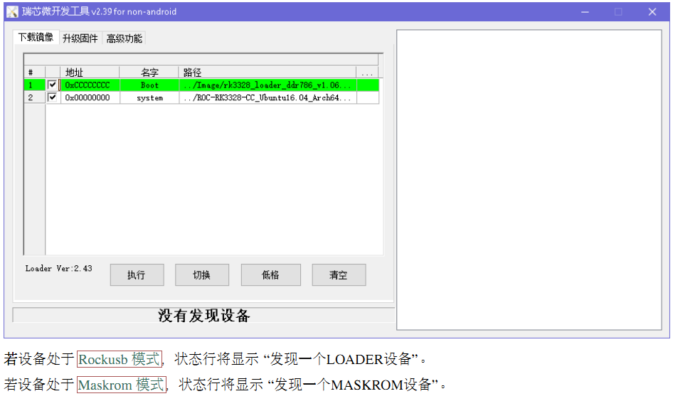
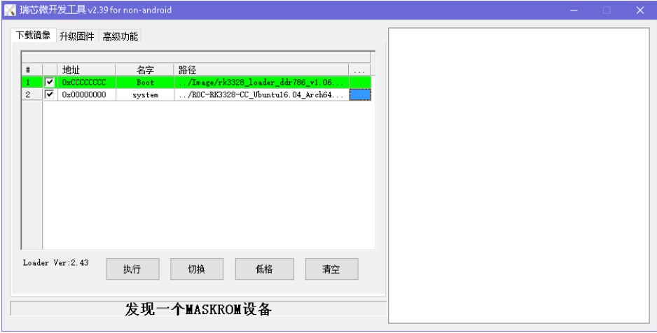

-
- eMMC 一般都是直接焊在主板上 ，有些虽然是可插拔的，但没有专用的读卡器 ，因此需要使用板载烧写的 
  方式来更新固件 ，即板上跑一个小系统 ，负责从主机或其它存储介质读取固件 ，再烧写到 eMMC 上
- 取决于 eMMC 现存的内容 ，开发板有两种特殊的启动模式： Rockusb 模式 和 Maskrom 模式 。
- Rockusb 模式
	- 通常只需要进入 Rockusb 模式 即可升级现有的 Android 或 Ubuntu 系统 。这种方式升级方式一般适用于 RK 
	  固件 或  分区映像
	- 开发板启动后 ，CPU 如果在 eMMC  中找到有效 的 IDB (IDentity Block) ，它将从 eMMC 读取并加载 boot- 
	  loader ，并将执行控制权交给它 。
	- 如果 bootloader 检测到 Recovery 按钮按下并且 USB  已连接 ，它就会进入 Rockusb 模式，等待来 自主机的命 令 。
- Maskrom 模式
	- Maskrom 模式 则是系统未能识别到合法的启动设备而进入的模式 。烧写原始固件到 eMMC 必须要进入该模 
	  式
	- 如果开发板上电后遇到以下情况之一：
		- •  eMMC 内容为空 。
		- •  eMMC 上的 bootloader 损坏 。
		- •  将 eMMC 数据/时钟引脚接地 ，eMMC读取数据失败 。
		- CPU 在 eMMC  中就会找不到有效的 IDB (IDentity Block) ，转而执行一段小型的 ROM 代码 ，等待主机通过 USB 上   bootloader 来初始化 DDR 内存并进入升级状态 。这种模式称为 Maskrom 模式  。
		- 强制进入 MaskRom 模式 涉及到硬件操作 ，具有一定的风险，因此操作上需要 非非非常常常谨谨谨慎慎慎
- 
-
- 烧写 原始固件
	- 原始固件需要从 eMMC  的偏移地址为 0  的位置开始烧写 。但在 Rockusb 模式 下无法做到这点 ，因为所有 
	  LBA 写入操作会偏移 0x2000 个扇区  （即 LBA0 对应于存储设备上第 0x2000 个扇区） 。因此 ，开发板必须 
	  强制进入 Maskrom 模式 才能烧写原始固件 。
	- 使用 AndroidTool 烧写原始固件到 eMMC 的步骤如下：
		- 1.  强制设备进入 Maskrom 模式 。
		- 2.  运行 AndroidTool 。
		- 3.  打开 “下载镜像” 制表页 。
		- 4. 保持表格的第一行不变，使用默认的 “Loader” 文件 。
		- 5. 点击第二行右侧的空白单元格 ，在弹出的文件对话框里打开原始固件文件 。
		- 6. 点击 “执行” 按钮开始烧写
		- 
- 烧写 RK 固件
	-