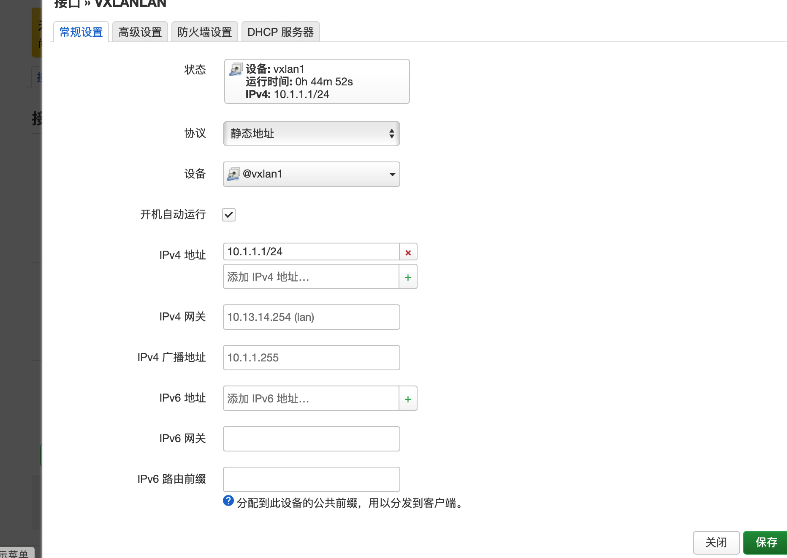

- [佛西博客 - 网络虚拟化-Proxmox VE vxlan和openwrt](https://foxi.buduanwang.vip/virtualization/pve/2775.html/)
  tags:: [[SendToLogseq]]
	- 有一说一，pve的sdn的snat做的真的不咋滴。
	- 在此次的环境中，我们引入了openwrt来做dhcp和snat。
	- 我们这里创建了一个vxlan的区域，对端地址使用openwrt的ip，或者多个openwrt的ip
	- 
	- 随后在openwrt上安装vxlan组件。
	- ```
	  opkg install kmod-vxlan luci-proto-vxlan vxlan
	  ```
	- 安装好了，重启openwrt。 创建一个vxlan的设备。远程地址依旧是组播地址，本地地址选择可以和pve通信的地址，网络标识符需要和vnet一致。绑定组网的物理接口。
	- 
	-
	- 这样就有了一个基础的vxlan通道了。
	-
	- 创建一个虚拟的ip，用于网络通信。设备绑定为刚才的vxlan设备。
	- 
	- 这样网络就组成了。如果需要虚拟机能上网，需要配置对应的nat转发。
	- 
	- 在虚拟机也可以上网
	- 